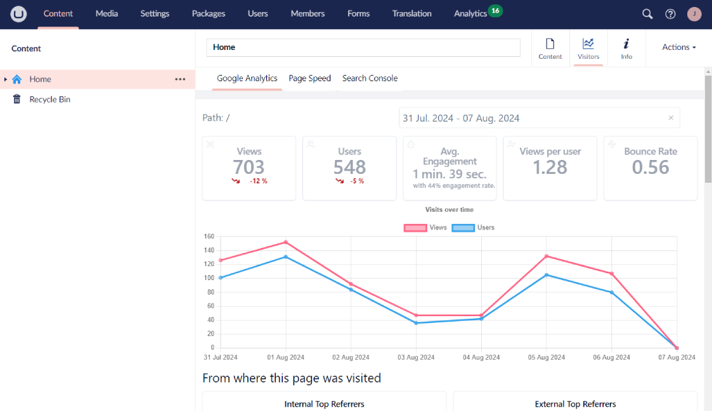
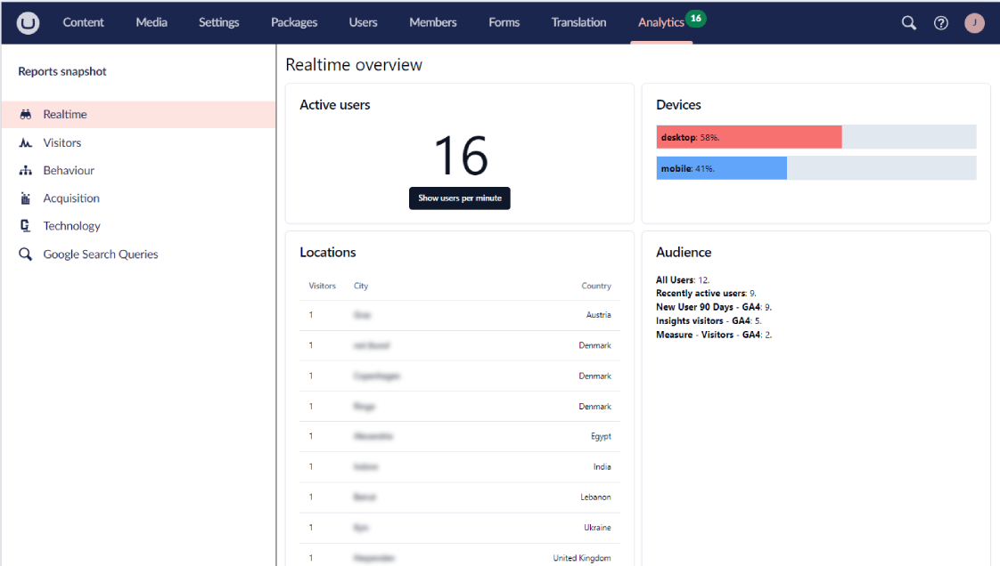

# Flowcourier Umbraco Support

*  in
* in 

- [Create an Issue]( https://github.com/flowcourier/Flowcourier.Umbraco.Support/issues)
- [Reporting a Vulnerability](https://github.com/flowcourier/Flowcourier.Umbraco.Support/blob/main/SECURITY.md)

See the website and documentation
- [https://analytics.flowcourier.com/](https://analytics.flowcourier.com/)

# Visitor on a page

# Real Time

# Site wide reporting

