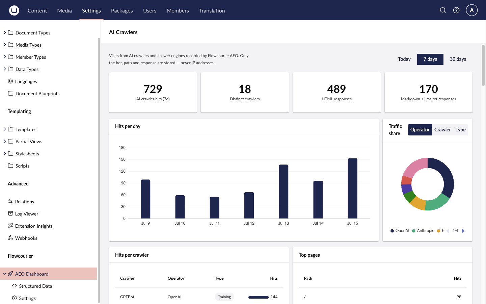

# AI crawler analytics

Flowcourier AEO recognises the user agents of 150+ AI crawlers — OpenAI (GPTBot, ChatGPT-User, OAI-SearchBot), Anthropic (ClaudeBot, Claude-User, Claude-SearchBot), Perplexity, Google-Extended, Meta, Apple, Common Crawl, Bytespider and the long tail besides — and records every visit: which bot, which path, response status, whether it was served **HTML, Markdown, llms.txt or robots.txt**, and a **verification verdict** (verified / spoofed / unverifiable — see [Crawler verification & blocking](/docs/aeo/guides/crawler-verification-and-blocking/)).

Spoofed hits — vulnerability scanners wearing an AI user agent — are blocked, excluded from the traffic aggregates below, and reported separately, so the numbers you see are real crawler traffic.

## The AEO Dashboard

Open **Settings → Flowcourier → AEO Dashboard** in the backoffice:

- **Hits per crawler**, with operator and purpose — training, AI search, or live assistant fetches — so you can tell "a model is being trained on my content" apart from "a user asked an assistant about my site right now". A **filter box** narrows the table as you type.
- **HTML vs Markdown ratio** — is your AEO surface actually being used?
- **Top pages** the crawlers fetch, with a **search box** that looks up any page's crawler hits — not just the visible top 10.
- A **Verification** box showing, per impersonated crawler, how many hits verified against the vendor's ranges versus proved spoofed.
- A **recent-visits log** with per-hit verdict badges (verified / spoofed / unverifiable).
- A **"Spoofed requests blocked"** counter and a distinct "Spoofed" slice in the traffic-share donut.
- **Today, 7-day and 30-day** views.



The dashboard's children hold the [AI Referrals](/docs/aeo/guides/ai-referrals/) page, the [Blocking](/docs/aeo/guides/crawler-verification-and-blocking/) page, the [Structured Data](/docs/aeo/guides/structured-data/) form and a read-only settings page showing the effective configuration.

## What the crawler types mean

Every crawler carries a **Type** — shown in the per-crawler table, and as a
grouping in the Traffic share donut (the **Type** option). The type describes
*why* the bot is fetching your pages, and each one means something different for
your AI visibility:

- **Training** — the crawler is collecting pages to build a model-training
  corpus (GPTBot, ClaudeBot, Bytespider, CCBot, Google-Extended, …). Your
  content may end up baked into a future model's knowledge, but there's no
  attribution and no click back to you. It's a long-term, diffuse benefit at
  best — the model might "know about" your site months later, with no way to
  trace it.

- **AI search** — the crawler is building an AI search/answer index
  (OAI-SearchBot, PerplexityBot, Claude-SearchBot, Amazonbot, …). **This is
  the one that matters most for AEO**: these indexes are what ChatGPT Search,
  Perplexity and Claude's web search draw from when composing answers, and
  they typically cite the source. Being crawled here is roughly the AI
  equivalent of being indexed by Googlebot.

- **Assistant** — a live, on-demand fetch made on behalf of a real user's
  prompt (ChatGPT-User, Claude-User, Perplexity-User, MistralAI-User, …).
  Someone asked an AI assistant a question and it went and read your page
  *right now* to answer it. These are the closest thing to actual human
  traffic in the table — each hit generally corresponds to a real person
  seeing your content summarized or cited in their chat.

Practically: treat **AI search** and **Assistant** hits as your AEO success
metrics — they translate into citations and real readers. **Training** traffic
is the one to weigh against your content strategy; if you'd rather not feed
model corpora, block those crawlers on the
[Blocking page](/docs/aeo/guides/crawler-verification-and-blocking/#the-blocking-page)
(an enforced `403`, unlike robots.txt).

## Reading the rest of the dashboard

- **Stat cards** — total hits from real (verified or unverifiable) crawlers,
  distinct crawlers seen, HTML vs Markdown+llms.txt responses, and spoofed
  requests blocked in the selected window.
- **Hits per day / per hour** — the bar chart zero-fills quiet days, so gaps
  are real "no crawler came" periods, not missing data. The **Today** view
  switches to hourly bars. When intent data is available the bars stack by
  *intent* — **Training**, **AI search** and **User-triggered** (the per-hit
  form of the three crawler types above, where User-triggered is an
  Assistant-type fetch), plus a **Scanner** bucket for spoofed probes — so a
  scan wave reads differently from a burst of real assistant fetches. (Hits
  recorded before intent classification show as "Unknown".)
- **Traffic share** — group by *operator* (who runs the crawlers: OpenAI,
  Anthropic, Google…), by *crawler* (individual bots), or by *type* (the
  three categories above). The long tail collapses into "Other"; spoofed
  traffic appears as its own visually distinct slice, never mixed into the
  real crawler shares.
- **Hits per crawler** — every crawler seen in the window with operator, type
  and hit count. The **filter box** matches crawler name, operator *and* type
  label, so typing `assistant`, `training` or `Anthropic` narrows to that
  whole group — and the bars stay scaled to the unfiltered maximum, so
  proportions remain comparable while you filter.
- **Verification** — per impersonated crawler: verified hits, spoofed hits
  and the spoof rate. A high spoof rate on a crawler name tells you scanners
  favour that disguise; it says nothing bad about the real crawler.
- **HTML vs Markdown ratio** — a rising Markdown/llms.txt share means
  crawlers are discovering and preferring your AEO surface, which is exactly
  what you want: cleaner input for the models, cheaper rendering for you.
- **Top pages** — which content the crawlers actually pull. The list shows
  the top 10; the **search box** queries *every* crawled path in the selected
  range (case-insensitive, up to 50 matches ranked by hits, respecting the
  Today / 7 / 30-day toggle), so you can answer "do AI crawlers ever fetch
  this specific page?" directly. Spoofed hits are excluded, like everywhere
  else. If your key landing pages aren't here but your archive is, that's a
  signal to review your
  [llms.txt inclusion rules](/docs/aeo/guides/markdown-endpoints/).
- **Recent visits** — the raw log: timestamp, crawler, path, verification
  verdict badge, what was served, and status code.

## Where the crawler list comes from

The built-in list is derived from the community-maintained
[ai.robots.txt](https://github.com/ai-robots-txt/ai.robots.txt) dataset and
**refreshed with each package release** — so as new AI crawlers appear and that
project adds them, they arrive in the next AEO version. Flowcourier curates a
layer on top: the training / AI search / assistant category for the major
vendors, and the verification descriptors (published IP ranges and reverse-DNS
suffixes) that back [spoof blocking](/docs/aeo/guides/crawler-verification-and-blocking/)
— data ai.robots.txt doesn't carry.

The list does **not** update itself between releases. If a brand-new crawler
shows up before we ship it, add it yourself with
[`CrawlerAnalytics:AdditionalBots`](#appsettings-reference) — no release needed.
Likewise, `DisabledBots` mutes any built-in you don't care to track. Your config
always wins over the built-in list.

## Built for production safety

- **Never slows a request down** — matching is a cheap in-memory scan; hits go into a bounded queue and a background writer persists them in batches (one short transaction per flush, SQLite-friendly). Under pressure, hits are dropped rather than queued unboundedly.
- **GDPR-safe by default** — out of the box the analytics store no IP addresses and no query strings, and raw user agents are kept only as forensics on spoofed or failed-verification requests (where the parsed bot id can't be trusted). Site owners can opt in to storing addresses per hit via `IpStorage` — truncated (/24, /48), daily-salted hash, or full. The one table that *always* stores IPs is the security [block list](/docs/aeo/guides/crawler-verification-and-blocking/#privacy-gdpr), retention-bound.
- **Bounded storage** — a daily job prunes hits older than `RetentionDays` (default 90); the `FcAeoCrawlerHit` table is created automatically on startup.

## appsettings reference

All settings live under `Flowcourier:Aeo:CrawlerAnalytics` and are optional:

```jsonc
{
  "Flowcourier": {
    "Aeo": {
      "CrawlerAnalytics": {
        "Enabled": true,
        "RetentionDays": 90,
        "IpStorage": "None",
        "AdditionalBots": [
          { "Id": "mybot", "Name": "MyBot", "Vendor": "Acme", "Category": "search", "UserAgentToken": "MyBot" }
        ],
        "DisabledBots": [ "bytespider" ]
      }
    }
  }
}
```

| Setting | Default | Description |
|---------|---------|-------------|
| `Enabled` | `true` | Record AI-crawler visits and serve the dashboard data. |
| `RetentionDays` | `90` | Days of hits to keep (pruned daily); `0` keeps everything. |
| `FlushIntervalSeconds` | `15` | How often the background writer flushes queued hits (one batched transaction per flush). |
| `MaxBatchSize` | `200` | Maximum hits written per flush transaction. |
| `QueueCapacity` | `5000` | In-memory queue size between requests and the writer; overflow is dropped, never blocking a request. |
| `AdditionalBots` | `[]` | Extra crawlers to track: `{ Id, Name, Vendor, Category, UserAgentToken }`. `Category` is `training`, `search` or `assistant` (shown as Training / AI search / Assistant). |
| `DisabledBots` | `[]` | Ids of built-in crawlers to stop tracking (e.g. `bytespider`). |
| `IpStorage` | `None` | Whether and how the client address is stored per hit. `None` (default) stores no address at all; `Truncated` (/24, /48), `Hashed` (daily-salted) or `Full` opt in to scanner-cluster forensics. Verification always compares full addresses in memory regardless of this. |
| `ClientIpHeader` | `null` | Header carrying the real client address when a trusted edge injects one (e.g. Cloudflare's `CF-Connecting-IP`); default uses the connection's remote address. The package never parses `X-Forwarded-For` itself. |
| `CountryHeader` | `null` | Header carrying a two-letter country code from a trusted edge (e.g. `CF-IPCountry`); default records no country. |
| `ProbePathPatterns` | `/.`, `appsettings`, `wp-`, `_profiler`, `elmah.axd`, `/telescope/` | Case-insensitive path substrings that mark a spoofed request as a vulnerability scan (intent `scanner`). Configured entries are added to the defaults. |

Two more `CrawlerAnalytics` settings — `ReferralHosts` and `ReferralRetentionDays` — drive the [AI referrals](/docs/aeo/guides/ai-referrals/) feature and are documented there.
