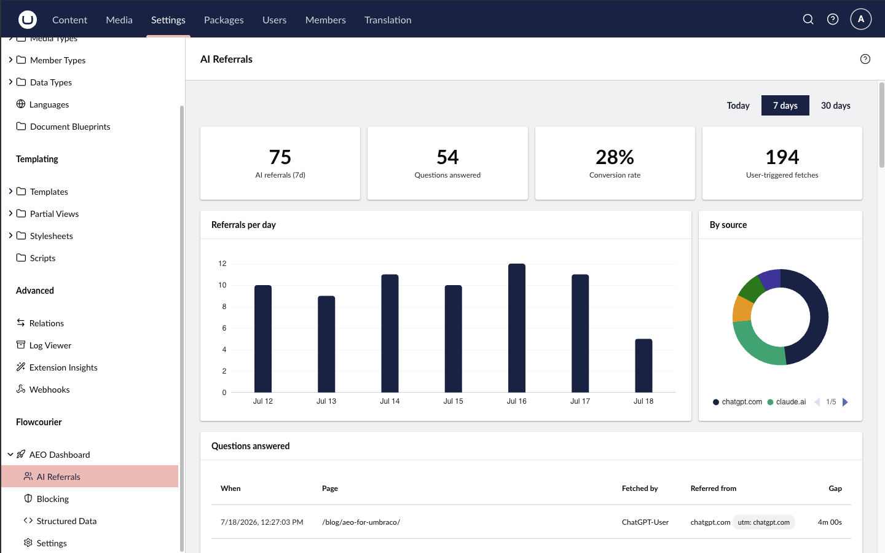

# AI referrals & questions answered

AI crawler hits tell you what the engines *read*. AI referrals tell you what
*humans did about it* — the payoff side of AEO.

When a visitor arrives from an AI surface — the Referer host (or `utm_source`)
matches claude.ai, chatgpt.com, perplexity.ai, copilot.microsoft.com,
gemini.google.com or your own `ReferralHosts` additions — the visit is recorded.
The **AI Referrals** page (Settings → Flowcourier → AEO Dashboard → AI
Referrals) turns those visits into a conversion metric.

## Questions answered

The headline metric is **"questions answered"**: a user-triggered crawler fetch
(intent `user` — an assistant reading your page to answer someone's prompt)
followed within 30 minutes by an AI-referred human visit to the **same path**.
That pairing is the closest observable proxy for *"someone asked an AI, it cited
your page, and they clicked through"*.

The page shows:

- **Stat cards** — AI referrals in the window, questions answered, the
  conversion rate (questions answered ÷ user-triggered fetches), and the
  user-triggered fetch count.
- **Referrals per day** — the trend over the selected Today / 7-day / 30-day
  window.
- **By source** — which AI surface sent the visitors (ChatGPT, Claude,
  Perplexity, …).
- **Questions answered** — the conversion list: the page, the fetching bot, the
  referring surface, and the time gap between the fetch and the visit.

## Privacy

Referral hits are recorded with **no IP address, no user agent and no query
string** — the path is stored without its query, `utm_source` is parsed and the
rest discarded — which keeps the `FcAeoReferralHit` table outside personal-data
scope by construction. Rows are kept forever by default
(`ReferralRetentionDays: 0`); set a positive number of days to prune older ones.

## Configuration

All settings are optional, under `Flowcourier:Aeo:CrawlerAnalytics`:

| Setting | Default | Description |
|---------|---------|-------------|
| `ReferralHosts` | ChatGPT, Claude, Perplexity, Copilot, Gemini | Extra AI surfaces to count as referral sources (host or `utm_source` match), added to the built-in list. |
| `ReferralRetentionDays` | `0` | Days of referral hits to keep; `0` keeps them forever. |

The correlation only needs crawler analytics to be on — referrals reuse the same
recorded `user`-intent fetches described in
[AI crawler analytics](/docs/aeo/guides/ai-crawler-analytics/).
