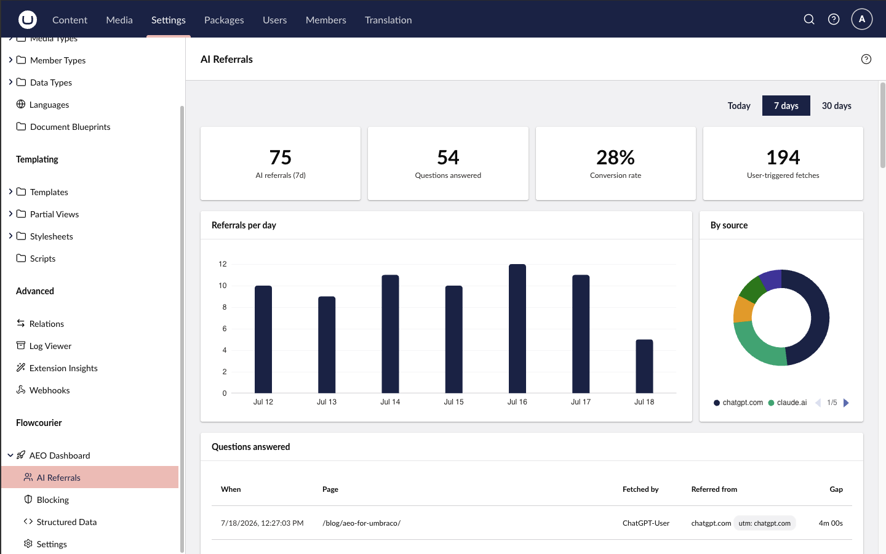

# AI referrals & questions answered

The **AI Referrals** page (Settings → Flowcourier → AEO Dashboard → AI
Referrals) is an attention funnel with three stages:

1. **AI reads** — a user-triggered assistant fetcher (ChatGPT-User,
   Claude-User, Perplexity-User, Gemini's fetchers, …) read a page to answer
   someone's question. This is the earliest observable signal that your
   content is reaching AI answers, and since 17.5.8 it leads the page: a
   "Recent AI reads" timeline shows when, which assistant, which page (by
   title) and in what format (HTML, Markdown, llms.txt).
2. **AI referrals** — a human arrived from an AI surface: the Referer host
   (or `utm_source`) matches claude.ai, chatgpt.com, perplexity.ai,
   copilot.microsoft.com, gemini.google.com or your own `ReferralHosts`
   additions.
3. **Questions answered** — the two correlated: the conversion metric.

Reads without referrals are normal — most people read the AI's answer and never
click a citation. The page says so explicitly instead of showing an empty
state. To understand what the AI was *asked*, see
[What AI assistants asked](/docs/aeo/guides/what-ai-assistants-asked/).

## Questions answered

The headline metric is **"questions answered"**: a user-triggered crawler fetch
(an **Assistant**-type crawler like ChatGPT-User or Claude-User reading your page
to answer someone's prompt — the "User-triggered" intent on the
[crawler dashboard](/docs/aeo/guides/ai-crawler-analytics/)) followed within 30
minutes by an AI-referred human visit to the **same path**. That pairing is the
closest observable proxy for *"someone asked an AI, it cited your page, and they
clicked through"*.

The page shows:

- **Stat cards** — AI reads, AI referrals, questions answered, and the
  conversion rate (questions answered ÷ AI reads) for the window.
- **Recent AI reads** — the timeline of assistant fetches, with the page's
  title standing in for the question it was answering.
- **Referrals per day** — the trend over the selected Today / 7-day / 30-day
  window.
- **By source** — which AI surface sent the visitors (ChatGPT, Claude,
  Perplexity, …).
- **Questions answered** — the conversion list: the page, the fetching bot, the
  referring surface, and the time gap between the fetch and the visit.

## Privacy

Referral hits are recorded with **no IP address, no user agent and no query
string** — the path is stored without its query, `utm_source` is parsed and the
rest discarded — which keeps the `FcAeoReferralHit` table outside personal-data
scope by construction. Rows are kept forever by default
(`ReferralRetentionDays: 0`); set a positive number of days to prune older ones.

## appsettings reference

All settings are optional, under `Flowcourier:Aeo:CrawlerAnalytics`:

| Setting | Default | Description |
|---------|---------|-------------|
| `ReferralHosts` | `claude.ai`, `chatgpt.com`, `perplexity.ai`, `copilot.microsoft.com`, `gemini.google.com` | AI surfaces whose outbound clicks count as referrals (matched on Referer host, including subdomains, or `utm_source`). Configured entries are **added** to these built-in defaults, not replaced. |
| `ReferralRetentionDays` | `0` | Days of referral hits to keep; `0` keeps them forever. |

The correlation only needs crawler analytics to be on — referrals pair each
AI-referred visit with the earlier **User-triggered** (Assistant-type) fetch of
the same page, the intent described in
[AI crawler analytics](/docs/aeo/guides/ai-crawler-analytics/).
