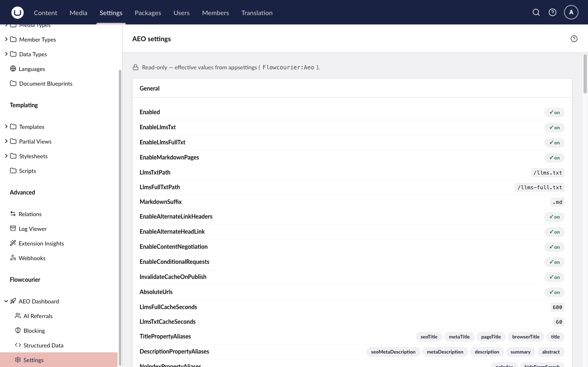

# Configuration

All settings are optional — the defaults work out of the box. Configure under the `Flowcourier:Aeo` section of `appsettings.json`:

```jsonc
{
  "Flowcourier": {
    "Aeo": {
      "Enabled": true,

      // Feature toggles
      "EnableLlmsTxt": true,
      "EnableLlmsFullTxt": true,
      "EnableMarkdownPages": true,

      // Route customization
      "LlmsTxtPath": "/llms.txt",
      "LlmsFullTxtPath": "/llms-full.txt",
      "MarkdownSuffix": ".md",

      // Discovery & HTTP behaviour
      "EnableAlternateLinkHeaders": true,
      "EnableAlternateHeadLink": true,
      "EnableContentNegotiation": true,
      "EnableConditionalRequests": true,
      "InvalidateCacheOnPublish": true,

      // robots.txt hint (opt-in)
      "Robots": {
        "Enabled": false,
        "Directive": "Llms",
        "IncludeFullTxt": true
      },

      // Structured data — see the Structured data guide
      "Schema": { "Enabled": true },

      // AI crawler analytics — see the AI crawler analytics guide
      "CrawlerAnalytics": { "Enabled": true },

      // Crawler verification & spoof blocking — see that guide
      "BotVerification": { "Enabled": true, "BlockSpoofed": true },

      // Behaviour
      "AbsoluteUrls": true,
      "LlmsTxtCacheSeconds": 60,
      "LlmsFullCacheSeconds": 600,

      // Content model mapping (which property aliases mean what)
      "TitlePropertyAliases": [ "seoTitle", "metaTitle", "pageTitle", "browserTitle", "title" ],
      "DescriptionPropertyAliases": [ "seoMetaDescription", "metaDescription", "description", "summary", "abstract" ],
      "NoIndexPropertyAliases": [ "noIndex", "hideFromSearch" ],
      "ExcludeFromListingPropertyAliases": [ "hideFromSitemap", "excludeFromSitemap", "umbracoNaviHide" ],

      // Document-type filtering
      "ExcludedDocumentTypeAliases": [],
      "OptionalDocumentTypeAliases": [ "errorPage", "error404", "searchPage", "loginPage", "thankYouPage" ],

      // Extra property aliases to keep out of Markdown bodies
      // (added on top of a built-in baseline of common system/SEO/layout aliases)
      "SkippedPropertyAliases": []
    }
  }
}
```

The `Schema`, `CrawlerAnalytics` and `BotVerification` sub-sections have their own reference tables in the [Structured data](/docs/aeo/guides/structured-data/#appsettings-reference), [AI crawler analytics](/docs/aeo/guides/ai-crawler-analytics/#appsettings-reference) and [Crawler verification & blocking](/docs/aeo/guides/crawler-verification-and-blocking/#appsettings-reference) guides.

## Settings reference

### Feature toggles & routes

| Setting | Default | Description |
|---------|---------|-------------|
| `Enabled` | `true` | Master switch. When `false`, all endpoints and the `.md` handler become no-ops. |
| `EnableLlmsTxt` | `true` | Serve `/llms.txt`. |
| `EnableLlmsFullTxt` | `true` | Serve `/llms-full.txt`. |
| `EnableMarkdownPages` | `true` | Serve pages as Markdown on the `.md` suffix. |
| `LlmsTxtPath` | `/llms.txt` | Route for the index. |
| `LlmsFullTxtPath` | `/llms-full.txt` | Route for the full dump. |
| `MarkdownSuffix` | `.md` | Suffix that triggers Markdown rendering. |

### Discovery & HTTP behaviour

| Setting | Default | Description |
|---------|---------|-------------|
| `EnableAlternateLinkHeaders` | `true` | Emit `Link: <….md>; rel="alternate"; type="text/markdown"` on HTML content pages, and `rel="canonical"` / `rel="alternate"; type="text/html"` back-pointers on Markdown responses. |
| `EnableAlternateHeadLink` | `true` | Inject `<link rel="alternate" type="text/markdown">` into `<head>` of rendered pages (no-op on hosts without the default MVC tag helpers — the Link header still provides discovery). |
| `EnableContentNegotiation` | `true` | Serve Markdown from the canonical page URL when the `Accept` header explicitly prefers `text/markdown`; emits `Vary: Accept` on both representations. |
| `EnableConditionalRequests` | `true` | Emit `ETag`/`Last-Modified` and answer `If-None-Match`/`If-Modified-Since` with `304`. |
| `InvalidateCacheOnPublish` | `true` | Clear the cached `llms.txt`/`llms-full.txt` whenever the published-content cache changes (TTLs stay as a safety net). |
| `Robots.Enabled` | `false` | Serve `/robots.txt` with an AEO discovery line — see [robots.txt hint](/docs/aeo/guides/markdown-endpoints/#robotstxt-hint). |
| `Robots.Directive` | `Llms` | Keyword used for the hint line. |
| `Robots.IncludeFullTxt` | `true` | Also emit a `{Directive}-full:` line for `/llms-full.txt`. |

### Output behaviour & caching

| Setting | Default | Description |
|---------|---------|-------------|
| `AbsoluteUrls` | `true` | Rewrite relative media/link URLs to absolute using the request scheme + host. |
| `LlmsTxtCacheSeconds` | `60` | In-memory cache lifetime for the index (per site root and culture). |
| `LlmsFullCacheSeconds` | `600` | In-memory cache lifetime for the full dump (per site root and culture). |

### Content model mapping

| Setting | Default | Description |
|---------|---------|-------------|
| `TitlePropertyAliases` | `seoTitle`, `metaTitle`, `pageTitle`, `browserTitle`, `title` | Property aliases checked in order for a page title; falls back to the node name. |
| `DescriptionPropertyAliases` | `seoMetaDescription`, `metaDescription`, `description`, `summary`, `abstract` | Property aliases checked in order for a page description/summary. |
| `NoIndexPropertyAliases` | `noIndex`, `hideFromSearch` | Boolean aliases that mark a page as no-index (excluded everywhere; `.md` returns 404). |
| `ExcludeFromListingPropertyAliases` | `hideFromSitemap`, `excludeFromSitemap`, `umbracoNaviHide` | Boolean aliases that exclude a page from the listings (still reachable individually as `.md`). |
| `ExcludedDocumentTypeAliases` | `[]` | Doc-type aliases to exclude entirely from AEO. |
| `OptionalDocumentTypeAliases` | error/search/login/thank-you | Doc-type aliases grouped under `## Optional` in `llms.txt`. |
| `SkippedPropertyAliases` | `[]` | Extra property aliases to keep out of Markdown bodies, added to the built-in baseline. |

## Settings page

Under **Settings → Flowcourier → AEO Dashboard → Settings** you'll find a read-only page showing the effective configuration of the running site.


