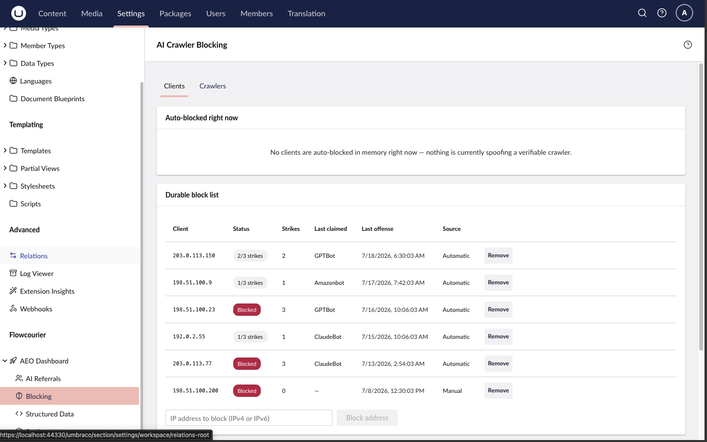

# Crawler verification & blocking

A surprising share of "AI crawler" traffic is fake. Vulnerability scanners wear
ClaudeBot, GPTBot or Amazonbot user agents to slip past naive bot filters while
probing for `/.env`, private keys, admin panels and debug endpoints. Real AI
crawlers don't do that — and most vendors publish an official way to prove an
address is really theirs. Flowcourier AEO uses it.

From 17.6.0, every request whose user agent claims a known AI crawler is
**verified against the vendor's official mechanism**, spoofers are **blocked
with `403`** (on by default), and repeat offenders escalate onto a persistent
block list you manage in the backoffice.

## How verification works

Each vendor's own published mechanism is checked:

| Vendor | Crawlers | Mechanism |
|--------|----------|-----------|
| OpenAI | GPTBot, ChatGPT-User, OAI-SearchBot | Published IP-range lists |
| Anthropic | ClaudeBot, Claude-User, Claude-SearchBot | Published IP-range list |
| Perplexity | PerplexityBot, Perplexity-User | Published IP-range lists |
| Google | GoogleOther, Google-Extended | Published IP-range list + reverse DNS |
| Apple | Applebot-Extended | Published IP-range list + reverse DNS |
| Amazon | Amazonbot | Reverse DNS (PTR + forward-confirm) |
| DuckDuckGo | DuckAssistBot | Published IP-range list |
| Common Crawl, ByteDance, Meta, Cohere, Mistral, You.com, AI2, Diffbot | CCBot, Bytespider, Meta-\*, … | None published — permanently *unverifiable* |

Every recognised-crawler request gets one of three verdicts, shown as a badge
in the dashboard's recent-visits log:

- **Verified** — the source address matches the vendor's published ranges or
  reverse DNS. This really is the crawler it claims to be.
- **Spoofed** — the vendor's sources were available and the address
  definitively failed them. The request is provably fake and is **blocked**
  (unless you turn `BlockSpoofed` off, in which case it's recorded but served).
- **Unverifiable** — no mechanism exists for that crawler, sources are still
  loading, or DNS failed. **Never blocked** on verification grounds.

Verification is built fail-open and adds no request latency:

- IP-list fetches and DNS lookups run **out of band** — the first request from
  an unknown address passes through while verification resolves; subsequent
  requests hit a cached verdict.
- List-fetch failures, DNS timeouts and missing source addresses all read as
  *unverifiable*, never as spoofed. Stale vendor lists keep serving while a
  refresh runs. Only a definitive mismatch ever blocks.
- Verdicts are compared **in memory only** — verification stores no IP
  addresses (see [Privacy](#privacy-gdpr)).

Spoofed hits are also **excluded from the analytics aggregates** — scan probes
no longer pollute your Top pages, per-crawler counts or traffic charts. They
surface instead as a "Spoofed requests blocked" stat card and a distinct
"Spoofed" slice in the traffic-share donut, so the activity stays visible
without masquerading as real crawler traffic.

## Three strikes → the durable block list

While a scanner is actively hammering your site, the in-memory verdict cache
blocks every request — that whole burst counts as **one offense episode**. An
address that comes back later and spoofs again earns another strike. After
`StrikesBeforeDurableBlock` episodes (default **3**), the address is written to
the durable block list (`FcAeoBlockedClient`), which survives restarts and
expires on a rolling window (`DurableBlockRetentionDays`, default 90 days after
the last offense — persistent attackers never age out).

Two safety properties are built in:

- **Durable blocks only apply to requests presenting an AI-crawler user
  agent.** A shared office IP, carrier NAT or VPN egress that once hosted a
  scanner can never lock out normal visitors browsing your site.
- An address that rotates several fake crawler identities (ClaudeBot, then
  GPTBot, then Amazonbot) burns a strike per identity and escalates faster —
  stronger evidence, faster block.

## The Blocking page

Open **Settings → Flowcourier → AEO Dashboard → Blocking**:



The page has two tabs.

### Clients tab

- **Auto-blocked right now** — a live, in-memory view: clients that claimed to
  be a verifiable crawler (GPTBot, ClaudeBot, …) from an address that provably
  isn't the vendor's, so their requests are answered `403` right now. Nothing
  is stored yet — each entry lapses on its own when the cached verdict expires
  (about an hour). Coming back and spoofing again counts as a strike; after the
  configured number of strikes (default 3) the address moves to the durable
  block list. One click promotes any entry there immediately.
- **Durable block list** — the permanent record, stored in the database:
  addresses that kept spoofing (hit the strike threshold) or that you blocked
  manually. They stay blocked across restarts until `DurableBlockRetentionDays`
  after their last offense, and only for requests wearing an AI-crawler user
  agent. Rows shown as "x/3 strikes" are offense records still counting toward
  a block, not blocks yet. Each row has an **Unblock** button, and you can
  block any IP address manually.
- **Allowlist** — addresses (or CIDR ranges, e.g. `203.0.113.0/24`) AEO
  **never** answers with `403`: crawler policy blocks, spoof blocking and the
  durable block list are all bypassed for them. Use it for your own uptime
  monitoring, a staging network, or a partner's fetcher. Their visits are still
  recorded and verified in analytics — the allowlist only suppresses blocking.

### Crawlers tab

- Every tracked crawler with its verifiability and a permanent **Block/Unblock**
  toggle. Blocking a crawler here answers *all* its requests with `403` — an
  enforced block, unlike advisory `robots.txt` rules that scrapers are free to
  ignore. Use it for crawlers you never want (say, Bytespider), verifiable or
  not.
- **Block all** switches from the default *allow-by-default* to
  *deny-by-default*: every recognised AI crawler gets `403` — including ones
  added in future registry updates — except the ones you then **Allow**. It's a
  deliberate, confirmed switch; the allowlist you build under it is remembered
  if you turn it back off and on. Combine it with the Markdown/llms.txt surface
  only if you truly want zero AI crawling; most sites want the opposite.

## Privacy (GDPR)

The crawler-analytics tables still store **no IP addresses, no raw user-agent
strings and no query strings**. Verification compares addresses in bounded,
TTL-expiring memory caches only.

The one deliberate exception is the **security block list**: a durable block
has to remember the offending address to survive a restart, so
`FcAeoBlockedClient` stores offender IPs — security-scoped, visible only to
backoffice admins, and auto-pruned on the `DurableBlockRetentionDays` window.
Processing an attacker's IP for abuse prevention is a textbook
legitimate-interest basis, the same one every WAF and fail2ban setup relies on.
If you want a strict no-IPs-ever posture, set
`StrikesBeforeDurableBlock: 0` — in-memory spoof blocking keeps working and
nothing IP-shaped is ever written.

## Behind a reverse proxy or CDN?

Enforcement uses ASP.NET Core's `RemoteIpAddress`. If your site sits behind a
proxy (Cloudflare, nginx, a load balancer), configure the framework's
[Forwarded Headers middleware](https://learn.microsoft.com/aspnet/core/host-and-deploy/proxy-load-balancer)
in the host site so the real client address reaches the app — AEO deliberately
never parses `X-Forwarded-For` itself. Until that's in place every request
appears to come from the proxy: verification will typically read
*unverifiable* (nothing breaks, nothing is wrongly blocked), but with a
misconfigured header chain set `BlockSpoofed: false` to be safe.

## appsettings reference

All settings live under `Flowcourier:Aeo:BotVerification` and are optional:

```jsonc
{
  "Flowcourier": {
    "Aeo": {
      "BotVerification": {
        "Enabled": true,
        "BlockSpoofed": true,
        "StrikesBeforeDurableBlock": 3,
        "DurableBlockRetentionDays": 90,
        // Per-crawler overrides (replace the built-in sources wholesale)
        "Bots": {
          "claudebot": {
            "IpListUrls": [ "https://claude.com/crawling/bots.json" ],
            "Cidrs": [],
            "RdnsSuffixes": []
          }
        }
      }
    }
  }
}
```

| Setting | Default | Description |
|---------|---------|-------------|
| `Enabled` | `true` | Verify claimed AI crawlers and record a verdict per hit. |
| `BlockSpoofed` | `true` | Answer provably spoofed requests with `403`. Off: spoofed hits are recorded but served. |
| `ExemptPrivateNetworks` | `true` | Never verify or block loopback, private or link-local addresses — keeps local development working. Disable to test enforcement locally. |
| `StrikesBeforeDurableBlock` | `3` | Spoofed episodes from one address before it lands on the durable block list; `0` disables escalation (no IPs are ever written). |
| `DurableBlockRetentionDays` | `90` | Rolling window a durable block survives after the last offense; `0` keeps blocks forever. |
| `IpListRefreshHours` | `24` | Vendor IP-list cache lifetime (stale-while-revalidate; stale lists are kept on fetch failure). |
| `IpListFetchTimeoutSeconds` | `10` | Timeout per IP-list fetch. |
| `DnsTimeoutSeconds` | `5` | Timeout per reverse-DNS lookup; timeouts mean *unverifiable*, never blocked. |
| `VerifiedTtlHours` | `24` | Cache lifetime of a *verified* verdict per (crawler, address). |
| `SpoofedTtlHours` | `1` | Cache lifetime of a *spoofed* verdict — kept short so a vendor expanding its ranges self-heals quickly. |
| `UnverifiableTtlMinutes` | `10` | Retry cadence for pending or failed verifications. |
| `MaxCachedVerdicts` | `50000` | Soft cap on cached verdicts (memory backstop against scanner floods). |
| `MaxBlockedHitsPerMinute` | `120` | Cap on blocked hits written to analytics per minute — blocking itself is never rate-limited; `0` records all. |
| `Bots` | `{}` | Per-crawler source overrides keyed by bot id: `{ IpListUrls, Cidrs, RdnsSuffixes }`. Replaces the built-in descriptor wholesale; an empty descriptor makes that crawler unverifiable. |

Vendor sources being config-overridable means a moved URL or newly published
range list is a one-line config change — no package update needed.

## Testing it locally

Local requests come from a private address, which is exempt by default. To see
enforcement work on a development site, disable the exemption and pin one
crawler to a range that matches nothing real (TEST-NET-3):

```jsonc
// appsettings.Development.json
{
  "Flowcourier": {
    "Aeo": {
      "BotVerification": {
        "ExemptPrivateNetworks": false,
        "Bots": {
          "gptbot": { "Cidrs": [ "203.0.113.0/24" ] }
        }
      }
    }
  }
}
```

```shell
curl -i -A "Mozilla/5.0 (compatible; GPTBot/1.1)" http://localhost:5000/
# HTTP/1.1 403 Forbidden — provably spoofed (your IP is not in 203.0.113.0/24)
```

A normal browser user agent still gets `200`, and the request shows up in the
dashboard with a red **Spoofed · blocked** badge. Remember to revert the
override — and note that three such tests will durably block your own loopback
address until you remove it on the Blocking page.
