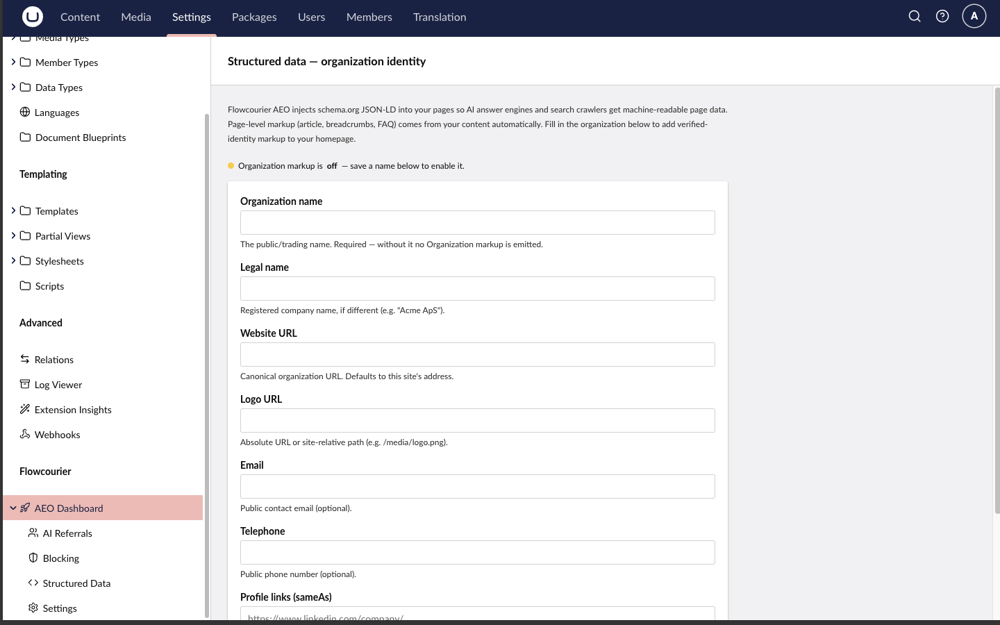

import { Steps } from '@astrojs/starlight/components';
import { Code } from '@astrojs/starlight/components';

# How to install Flowcourier AEO for Umbraco

Flowcourier AEO adds **Answer Engine Optimization** to your Umbraco site: it makes your published content readable by LLMs and AI answer engines (ChatGPT, Claude, Perplexity, Gemini, …) by serving it in the formats those tools understand — generated live from the content cache, with **no editor work and no content changes required**.

One package gives you four things:

- **`/llms.txt`** — a curated index of your site following the [llms.txt standard](https://llmstxt.org), with a link to each page's Markdown version.
- **`/llms-full.txt`** — the entire site rendered to Markdown in a single document.
- **`/{any-page}.md`** — append `.md` to any page URL and get a clean Markdown rendering instead of HTML.
- **Structured data (JSON-LD)** injected into every rendered page's `<head>`, plus an **AI crawler analytics dashboard** in the backoffice — with built-in **crawler verification** that blocks vulnerability scanners spoofing AI user agents.

AEO has no AI dependency — no Umbraco AI, no LLM provider, no API key. It is built for sites where Umbraco renders the front end (MVC/Razor) — headless setups are not supported (see [system requirements](/docs/aeo/start-here/system-requirements/)).

<Steps>

1. Install the package

    The package is available via NuGet. Visit [Flowcourier.Umbraco.AEO on NuGet](https://www.nuget.org/packages/Flowcourier.Umbraco.AEO/), search for it in Visual Studio, or run:

    <Code code="dotnet add package Flowcourier.Umbraco.AEO" lang="shell" />

    That's it — no composer, no `Program.cs` changes, no route configuration. The package self-registers through an Umbraco pipeline filter, and the crawler-analytics database table is created automatically on first startup.

2. Verify the endpoints

    Start the site and open:

    - `https://your-site/llms.txt` — the site index
    - `https://your-site/llms-full.txt` — the whole site as Markdown
    - `https://your-site/about-us.md` — any page URL + `.md`

    The output is derived from the live published-content cache, so it always reflects what's currently published — cached briefly in memory and refreshed immediately on publish.

3. Fill in your organization identity

    Go to **Settings → Flowcourier → AEO Dashboard → Structured Data** in the backoffice and enter your organization's name, logo, profile links and contact details. This is the one piece of structured data the package never guesses from content — page-level markup (WebPage/Article, breadcrumbs, FAQ) is generated automatically. See [Structured data](/docs/aeo/guides/structured-data/) for details.

    

4. Optional: advertise the files in robots.txt

    AEO can prepend discovery lines for `llms.txt` / `llms-full.txt` to your `robots.txt` (an existing physical file is preserved). It's opt-in:

    ```json
    {
      "Flowcourier": {
        "Aeo": {
          "Robots": { "Enabled": true }
        }
      }
    }
    ```

5. Watch the AI crawlers arrive

    Open **Settings → Flowcourier → AEO Dashboard**. Visits from GPTBot, ClaudeBot, PerplexityBot and 20+ other AI crawlers are recognised and counted — which bot, which pages, and whether they fetched HTML or your Markdown surface. Each visit is also **verified against the vendor's published IP ranges**, and scanners spoofing an AI user agent are blocked automatically — manage this on the dashboard's Blocking page. Privacy-safe by design: the analytics never store IP addresses or raw user-agent strings. See [AI crawler analytics](/docs/aeo/guides/ai-crawler-analytics/) and [Crawler verification & blocking](/docs/aeo/guides/crawler-verification-and-blocking/).

    

</Steps>

## Next steps

- Learn how [llms.txt & Markdown pages](/docs/aeo/guides/markdown-endpoints/) work — what gets included, discovery headers, content negotiation and multilingual sites.
- Configure [structured data (JSON-LD)](/docs/aeo/guides/structured-data/) — type mappings, FAQ markup and the organization form.
- Review the [AI crawler analytics](/docs/aeo/guides/ai-crawler-analytics/) dashboard and its privacy guarantees.
- See how [crawler verification & blocking](/docs/aeo/guides/crawler-verification-and-blocking/) stops vulnerability scanners that spoof AI crawlers — and lets you block any crawler permanently.
- Browse the full [configuration reference](/docs/aeo/guides/configuration/) — everything works out of the box, but every path, toggle and property alias is configurable.
