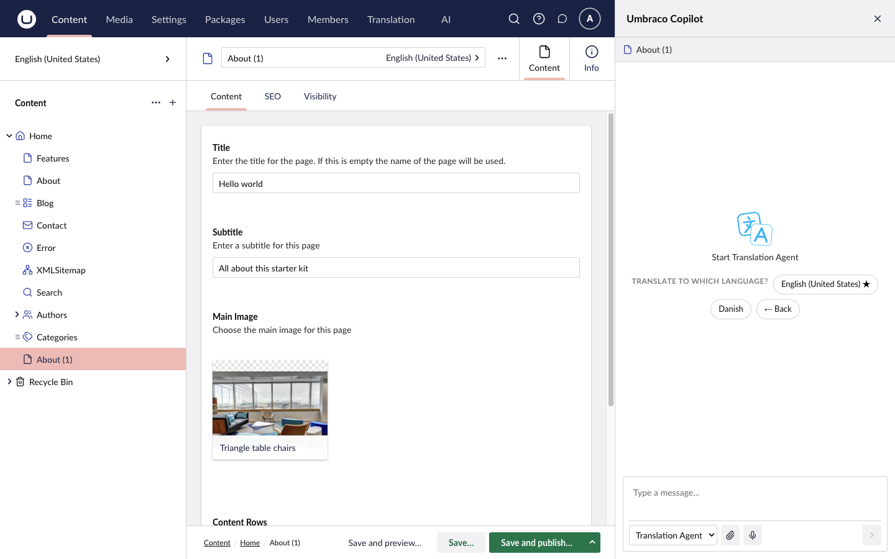
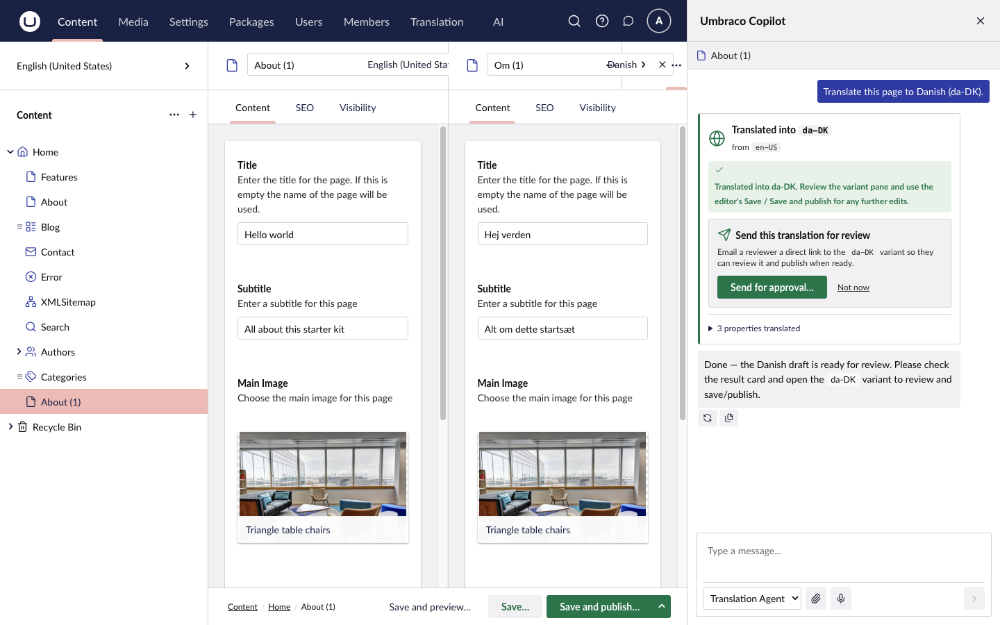
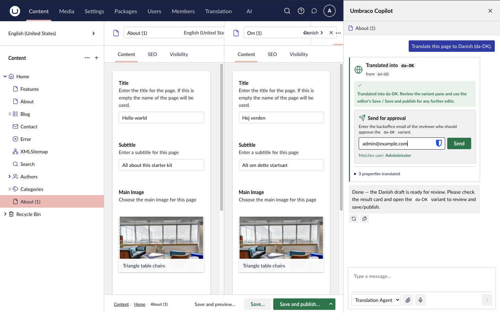
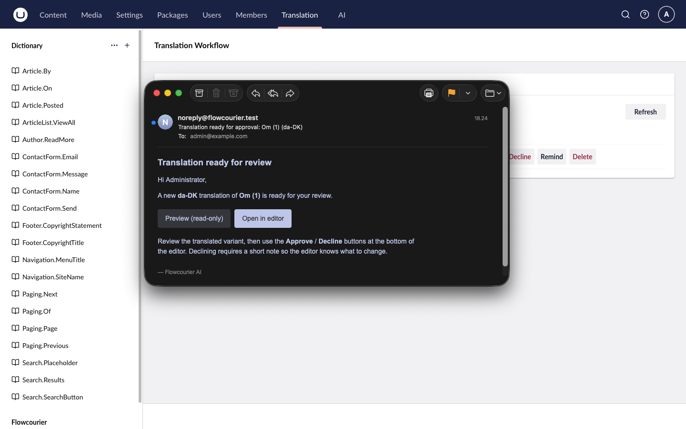
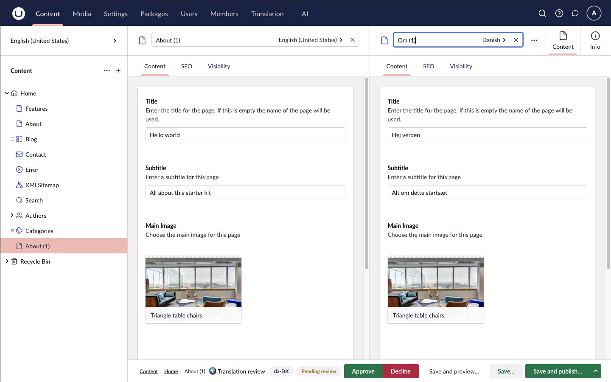
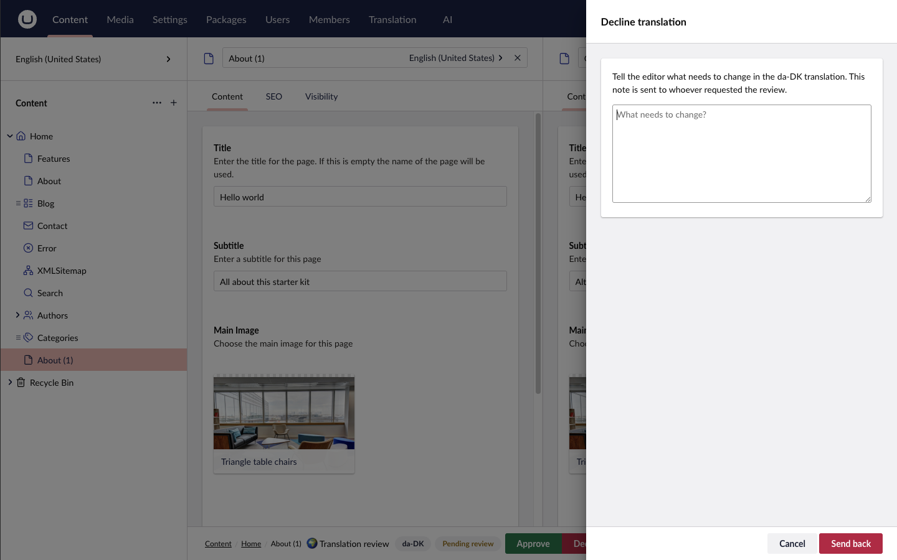
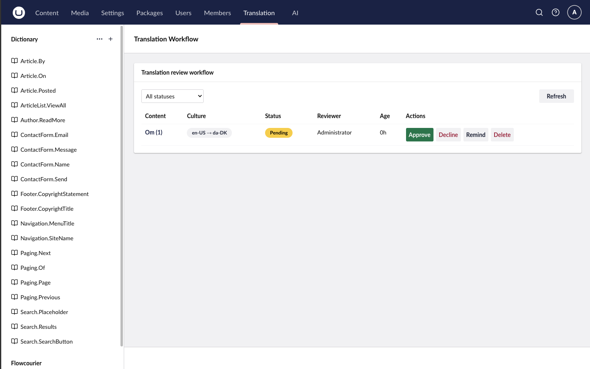

import { Image } from 'astro:assets';
import logo from '../../../../assets/ai/translation-agent-logo.svg';

<Image src={logo} alt="Translation Agent logo" width="70" />

# Translation Agent

The Translation Agent translates a content page into another culture variant directly from the Copilot, then routes the draft through an email-based review workflow: an editor sends the translation to a reviewer, the reviewer approves or requests changes, and reminders chase pending reviews automatically.

**Prerequisites:** [Umbraco AI with a Chat profile](/docs/ai/guides/umbraco-ai-setup/), content types that **vary by culture** with the target languages added under **Settings → Languages**, and SMTP for the approval emails.

## Install

```shell
dotnet add package Flowcourier.Umbraco.AI.Agents.Translation
```

No composer or startup code is needed. On the next startup the agent registers itself with the Umbraco AI Copilot (a Chat profile must exist first) and creates its review table automatically.

## How editors use it

1. Open a culture-varying page and launch the **Copilot**, or use the **Translate…** button in the workspace footer.
2. Pick the **Translation Agent** and use the "Translate to…" starter, then choose the target language. It can also be given as an ISO code (`da-DK`), a prefix (`da`) or a name ("Danish").

    

3. The agent translates the node name and every culture-varying property — plain text, rich text (HTML tags preserved) and Block List/Block Grid content (only human-readable text is translated; structure, GUIDs and aliases stay untouched) — and saves the result **as a draft in the target culture only**. The source culture is never modified.

    

4. The editor reviews the draft and either publishes it directly or sends it for approval.

### Review workflow

**Send for approval** — the editor enters a reviewer's email address. The reviewer must be an existing Umbraco backoffice user with that email (the field validates the address against backoffice users as you type).



The reviewer receives an email with a read-only preview link and a direct link to the variant in the editor:



**Approve / Decline** — the reviewer acts from the buttons in the document workspace footer, with source and translation side by side, or from the **Translation Workflow** dashboard in the **Translation** section:



Declining requires a note explaining what needs to change; it is emailed to whoever requested the review:



**Translation Workflow dashboard** — all reviews are listed under **Translation → Flowcourier → Translation Workflow**, filterable by status, with Approve, Decline, Remind and Delete actions:



**Statuses** — a review moves through `Pending` → `Approved`/`Published`, `ChangesRequested` (after a decline, the editor can resubmit) or `Cancelled`. If a reviewer simply publishes the culture variant themselves, any open review for that content and culture is automatically marked `Published` and the requester is notified.

### Required permissions

Reviewers and editors using the dashboard need access to the **Translation** section — grant it under **Users → Groups**. Reviewers must be backoffice users with an email address.

## SMTP configuration

Approval, reminder and status emails are sent through Umbraco's standard SMTP settings:

```json
{
  "Umbraco": {
    "CMS": {
      "Global": {
        "Smtp": {
          "From": "noreply@yoursite.com",
          "Host": "smtp.yourprovider.com",
          "Port": 587,
          "Username": "…",
          "Password": "…"
        }
      }
    }
  }
}
```

`From`, `Host` and `Port` are the minimum. If no `From` address is configured, translation itself keeps working but emails are skipped with a log warning, and the **Send for approval** action returns an error explaining that the SMTP From address is missing.

For local development you can write emails to a folder instead of a real server:

```json
"Smtp": {
  "From": "noreply@yoursite.test",
  "DeliveryMethod": "SpecifiedPickupDirectory",
  "PickupDirectoryLocation": "umbraco/Data/emails"
}
```

## appsettings reference

All settings are optional — the agent works out of the box with the defaults below. The effective configuration is shown read-only under **Settings → Flowcourier → Translation**, including a copyable override snippet.

### `Flowcourier:Translation`

| Setting | Default | Meaning |
|---------|---------|---------|
| `KnowledgeContextAlias` | *(empty)* | Alias of an Umbraco AI **Context** whose Brand Voice / Text resources are injected into every translation prompt — use it for terminology lists, tone-of-voice rules or do-not-translate terms. Create the Context in the backoffice AI section and reference its alias here. Empty disables knowledge injection; an invalid alias is ignored. |

### `Flowcourier:TranslationReview`

| Setting | Default | Meaning |
|---------|---------|---------|
| `PublishOnApprove` | `false` | When `false`, approval only marks the review **Approved** and leaves publishing to the requester. When `true`, the culture variant is published immediately on approval. |
| `RemindersEnabled` | `true` | Master switch for the reminder background job. |
| `ReminderAfterHours` | `24` | A pending review becomes eligible for a reminder once it is this many hours old. |
| `ReminderIntervalHours` | `24` | Minimum hours between reminders for the same review. |
| `MaxReminders` | `3` | Maximum reminders sent per review. |
| `ReminderScanIntervalMinutes` | `60` | How often the background job scans for due reminders. |

Example with everything overridden:

```json
{
  "Flowcourier": {
    "Translation": {
      "KnowledgeContextAlias": "translation-knowledge"
    },
    "TranslationReview": {
      "PublishOnApprove": true,
      "RemindersEnabled": true,
      "ReminderAfterHours": 24,
      "ReminderIntervalHours": 24,
      "MaxReminders": 3,
      "ReminderScanIntervalMinutes": 60
    }
  }
}
```

## Good to know

- Review records are stored in a `FcTranslationReview` table, created automatically on first startup — no manual migration.
- The reminder job runs only on the scheduling server in load-balanced setups, so reminders are not duplicated.
- If the LLM call fails mid-translation, the affected property falls back to the source text verbatim rather than being left empty.
