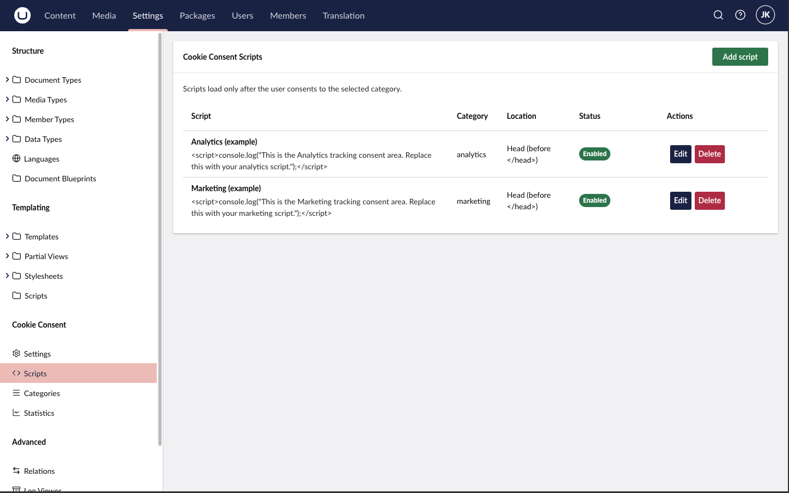

import { Code } from '@astrojs/starlight/components';

# Common scripts

Managed scripts are added under **Settings → Cookie Consent → Scripts**. Each script has a name, a category, a location (`Head`, `BodyStart` or `BodyEnd`) and the script content — paste the vendor snippet as-is, including the `
`} lang="html" />

If you enable [Google Consent Mode v2](/docs/cookie-consent/guides/google-consent-mode/), GA4 receives consent signals automatically and adjusts its behavior before and after consent.

## Meta Pixel

Category: **Marketing** · Location: **Head**

<Code code={``} lang="html" />

Remember the matching auto-clear entry `_fbp` on the Marketing category (included by default).

## LinkedIn Insight Tag

Category: **Marketing** · Location: **BodyEnd**

<Code code={`
`} lang="html" />

## Google Tag Manager

Two common approaches:

1. **GTM inside a category** — add the GTM container snippet as a managed script under **Marketing** (or Analytics, depending on what the container fires). Simple, but all tags in the container share one consent category.
2. **GTM + Consent Mode (recommended)** — load GTM unconditionally in your template and let [Google Consent Mode v2](/docs/cookie-consent/guides/google-consent-mode/) gate the individual tags. Google-side tags respect the consent signals; configure built-in consent checks for non-Google tags in GTM's tag settings.

## Which category does a script belong to?

As a rule of thumb: measurement-only tools go to **Analytics**; anything that builds advertising audiences, tracks conversions or follows users across sites goes to **Marketing**. Some vendors span both — HubSpot's tracking script, for example, is conventionally classified as Marketing because it enables marketing automation, even though it also does analytics. When in doubt, check the vendor's own cookie documentation and classify by the most invasive purpose.
