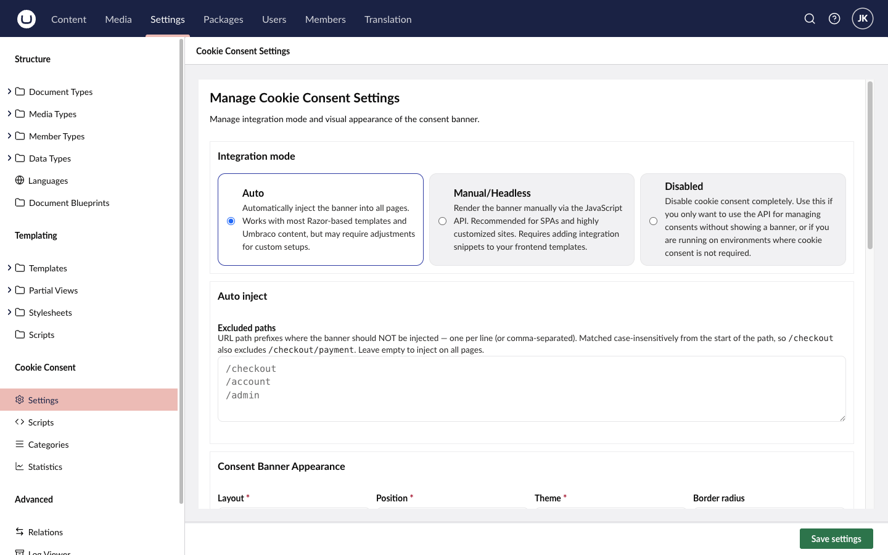
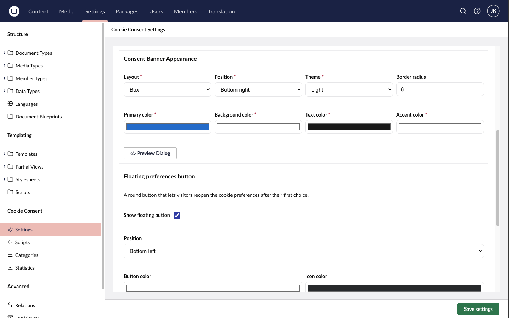
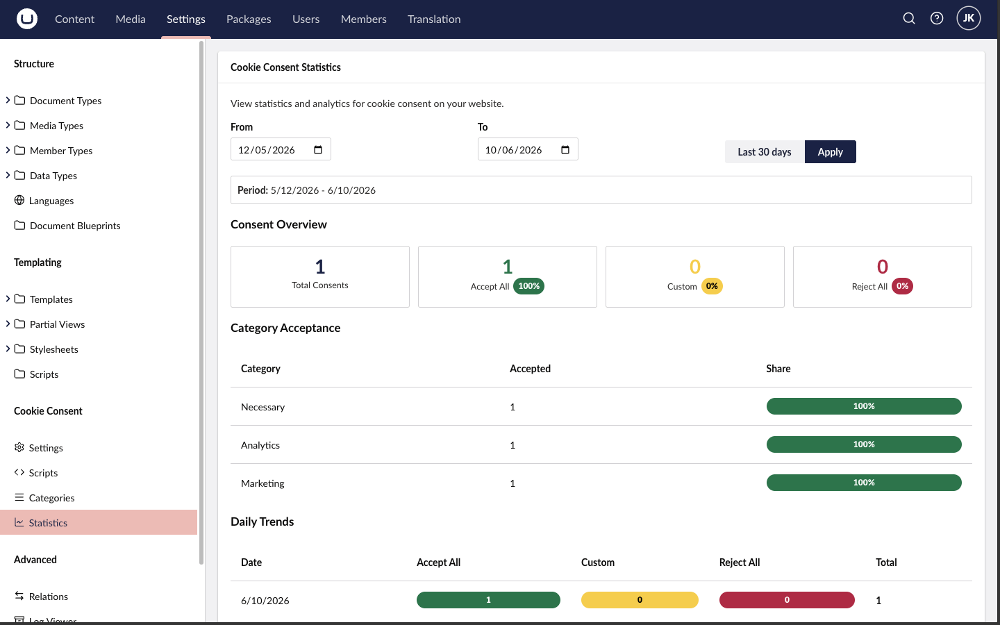

# Configuration

All configuration lives in the Umbraco backoffice under **Settings → Cookie Consent**, with four dashboards: **Settings**, **Scripts**, **Categories** and **Statistics**. Everything is stored in the database, so it survives deployments and doesn't require appsettings changes.

## Integration mode

The most important setting. It controls how the consent banner gets onto your pages.

| Mode | Use when |
|------|----------|
| **Auto** (default) | Traditional Umbraco site. Middleware injects the consent script into every HTML response — zero template changes. |
| **Manual/Headless** | You control placement yourself: either render the banner via the [JavaScript API](/docs/cookie-consent/guides/javascript-api/) in your own templates, or run a decoupled frontend (Next.js, Astro, …) against the REST API. |
| **Disabled** | Turns the package off completely without uninstalling. |

## Auto-inject settings

Used in **Auto** mode:

- **Location** — where the init script is injected: `Head`, `BodyStart` or `BodyEnd` (default).
- **Excluded paths** — paths where the banner should not appear, e.g. `/checkout`, `/account/login`, `/api`.

## Appearance

Under **Settings → Appearance** you control how the banner looks:

- **Layout**: `box` (default), `cloud` or `bar`
- **Position**: `bottom-right` (default), `bottom-center`, and other placements
- **Colors**: primary (default `#0078d4`), background, text and accent
- **Border radius**: default `8` px

Use the **Preview Dialog** button to see the result while you edit.

## Floating button

A small floating button lets visitors reopen their cookie preferences after the banner is dismissed — a GDPR requirement, since consent must be as easy to withdraw as to give.

- **Enabled**: on by default
- **Position**: `bottom-left` by default
- **Background and icon colors** are configurable

If you disable it, link to the preferences modal yourself, e.g. from the footer, using `window.FlowcourierConsent.showPreferences()`.

## Statistics

Consent decisions (accept all / reject all / custom selections) are logged anonymously so you can see consent rates in the **Statistics** dashboard.

- **Enabled**: on by default
- **Retention**: 90 days by default, after which records are cleaned up automatically

## API settings

The public REST API serves the banner configuration and receives consent statistics. Relevant mainly for **Headless** mode:

- **CORS**: enabled by default; restrict with **Allowed origins** when your frontend runs on a different domain
- **API key**: optional; off by default

Public endpoints are served under `/fc-cookie-consent/api/` — `config`, `languages`, `stats`, `stats/summary` and `ping`.
