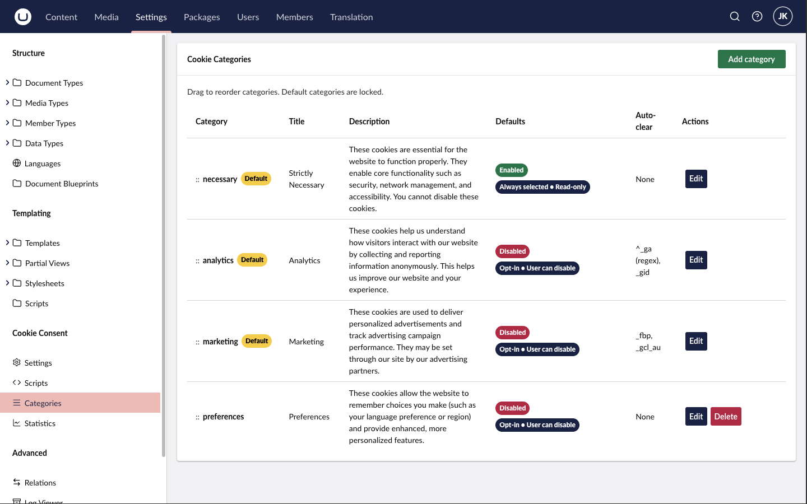

# Cookie categories

Flowcourier Cookie Consent ships with the four-category model used by most European consent implementations and required for granular consent under Danish and EU guidance. Manage them under **Settings → Cookie Consent → Categories**.

## Default categories

| Category | Default state | Typical contents |
|----------|--------------|------------------|
| **Necessary** | Enabled, read-only | Session and auth cookies, CSRF tokens, load balancer affinity, the consent cookie itself, shopping cart. No consent required. |
| **Analytics** | Disabled | GA4, Matomo (cookie mode), Microsoft Clarity, Hotjar, Siteimprove. |
| **Marketing** | Disabled | Meta Pixel, LinkedIn Insight Tag, Google Ads/remarketing, TikTok Pixel, HubSpot tracking — and embedded third-party content such as YouTube or Vimeo. |
| **Preferences** | Disabled | Language/region choice, currency, theme, chat widget settings. Many smaller sites skip this category. |

Only enable the categories your site actually uses — an empty category in the banner just adds noise for visitors.

Category titles and descriptions are dictionary keys (e.g. `FlowcourierCookieConsent.Category.Analytics.Title`), so they are fully translatable — see [Translations](/docs/cookie-consent/guides/translations/).

## Auto-clear

When a visitor withdraws consent for a category, cookies already set by that category's scripts should be removed. Each category has an **auto-clear** list of cookie names (exact match or regex) that are deleted on rejection.

Defaults:

- **Analytics**: `^_ga` (regex, matches `_ga` and `_ga_*`), `_gid`
- **Marketing**: `_fbp` (Meta), `_gcl_au` (Google Ads)

Add entries for any other vendors you use — for example `_hjSession*` patterns for Hotjar or `li_*` for LinkedIn.

## Consent-exempt analytics

Cookieless analytics tools such as Plausible or Fathom set no cookies and don't read from the visitor's device, so they generally fall outside the ePrivacy consent requirement. You can load such scripts directly in your templates rather than as a managed script — they don't need to be gated behind the Analytics category. Document them in your privacy policy regardless, since IP processing still falls under GDPR.

## Do I need more categories?

The four defaults cover the typical Danish/EU SMB and enterprise site. A pattern worth knowing from commercial CMPs is an *unclassified* bucket for unknown scripts; with this package the equivalent discipline is simpler — any script not added as a managed script (or not consent-gated manually) loads unconditionally, so review your templates for stray tracking snippets when you install.
