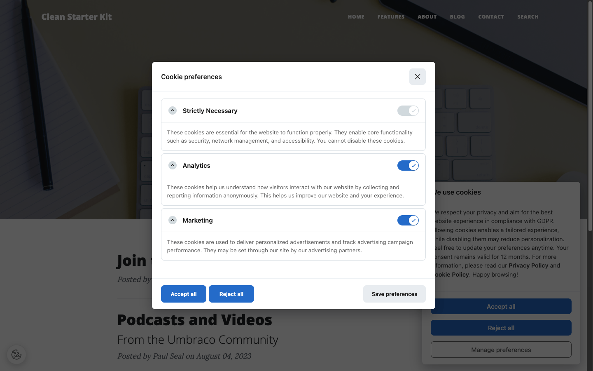

# Translations

All visitor-facing text is resolved through the Umbraco Dictionary, so translations follow your normal Umbraco translation workflow under **Translation → Dictionary**. The banner automatically uses the language of the current page.

All keys are nested under the parent key `FlowcourierCookieConsent`.

## Banner texts

| Key | English default |
|-----|-----------------|
| `FlowcourierCookieConsent.Modal.Title` | We use cookies |
| `FlowcourierCookieConsent.Modal.Description` | We use cookies to enhance your experience. By continuing to visit this site you agree to our use of cookies. |
| `FlowcourierCookieConsent.Modal.AcceptAll` | Accept all |
| `FlowcourierCookieConsent.Modal.RejectAll` | Reject all |
| `FlowcourierCookieConsent.Modal.ManagePreferences` | Manage preferences |
| `FlowcourierCookieConsent.Modal.Close` | Close |

## Preferences modal

| Key | English default |
|-----|-----------------|
| `FlowcourierCookieConsent.Preferences.Title` | Cookie preferences |
| `FlowcourierCookieConsent.Preferences.Description` | Choose which cookies you want to accept. |
| `FlowcourierCookieConsent.Preferences.SavePreferences` | Save preferences |
| `FlowcourierCookieConsent.Preferences.AcceptAll` | Accept all |
| `FlowcourierCookieConsent.Preferences.RejectAll` | Reject all |

## Category labels

Each category's title and description are dictionary keys, e.g.:

| Key | English default |
|-----|-----------------|
| `FlowcourierCookieConsent.Category.Necessary.Title` | Necessary |
| `FlowcourierCookieConsent.Category.Analytics.Title` | Analytics |
| `FlowcourierCookieConsent.Category.Marketing.Title` | Marketing |
| `FlowcourierCookieConsent.Category.Preferences.Title` | Preferences |

…with matching `.Description` keys for each.

## Tips

- Missing dictionary entries fall back to the English defaults, so you can translate incrementally.
- Remember that under Danish guidance (Datatilsynet), the banner text must clearly describe the purposes — avoid vague descriptions like "to improve your experience" for marketing cookies in your translations.
