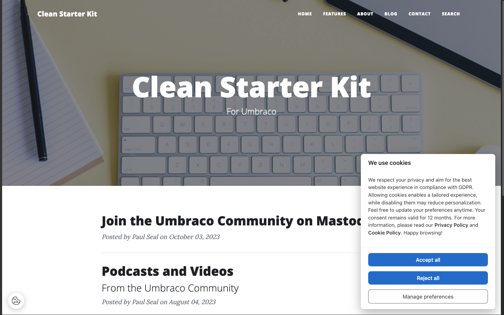

import { Steps } from '@astrojs/starlight/components';
import { Code } from '@astrojs/starlight/components';

# How to install and use Cookie Consent for Umbraco

Flowcourier Cookie Consent is a free, open-source (MIT) GDPR cookie consent package for Umbraco with Google Consent Mode v2 support. Everything is configured in the Umbraco backoffice — no external consent service, no license file needed.

<Steps>

1. Install the extension

    The extension is available via NuGet. Visit [Flowcourier Cookie Consent on NuGet](https://www.nuget.org/packages/Flowcourier.Umbraco.CookieConsent/), search for the package in Visual Studio, or run:
    <Code code="dotnet add package Flowcourier.Umbraco.CookieConsent" lang="shell" />

    Database tables are created automatically on first startup — no manual migration steps.

2. Open the Cookie Consent settings in the backoffice

    Start the site and go to **Settings → Cookie Consent** in the Umbraco backoffice. With the default **Auto** integration mode, the consent banner is already injected on every frontend page. Nothing needs to be added to your templates.

    

3. Review the cookie categories

    Four categories are pre-configured: **Necessary** (always on, read-only), **Analytics**, **Marketing** and **Preferences**. Enable the categories your site actually uses — see [Cookie categories](/docs/cookie-consent/guides/cookie-categories/) for guidance on what belongs where.

4. Add your scripts

    Replace the example scripts under **Settings → Cookie Consent → Scripts** with your real tracking snippets (GA4, Meta Pixel, LinkedIn Insight Tag, …). Each script is assigned to a category and is only executed after the visitor consents to that category. See [Common scripts](/docs/cookie-consent/guides/common-scripts/) for ready-to-use examples.

</Steps>

That's it. Visit your site in a private browser window and the banner appears. Accept or reject categories and verify in the browser console that gated scripts only run after consent.

## Optional next steps

- Enable [Google Consent Mode v2](/docs/cookie-consent/guides/google-consent-mode/) if you use Google Analytics or Google Ads.
- Match the banner to your brand under **Settings → Appearance** — layout, position, colors and border radius.
- Translate banner texts via the Umbraco Dictionary — see [Translations](/docs/cookie-consent/guides/translations/).
- Check accept/reject rates in the **Statistics** dashboard.
