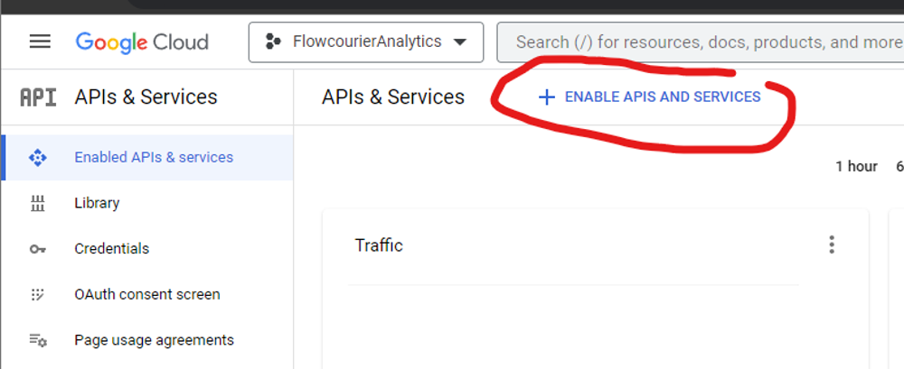

import { Steps } from '@astrojs/starlight/components';

# Configure Access to Google Services

On this page, you'll learn how to set up a dedicated Service Account to access Google Analytics, Google Search Analytics and PageSpeed Insights data. This Service Account is used by Flowcourier to securely retrieve and analyze Google Analytics data.

## Create API Project and Add Service Account

### Step 1. Create a new project
Go to [Google APIs](https://code.google.com/apis/console/) and create a new project, for example, "FlowcourierAnalytics" _(or use an existing project)_.

### Step 2.  API's & services
Click "ENABLE APIS AND SERVICES" in Enabled API's & services.

### Step 3. Google Analytics Data API
Search "Google Analytics Data API," select it, and click the ENABLE button.

### Step 4. Create credentials
In the Manage view of "Google Analytics Data API," click the CREATE CREDENTIALS button.

- Choose Application data
- In "Are you planning to use this API with Compute Engine..." answer No.
- Click the NEXT button.

### Step 5. Service Account Details
Give a name, for example, "sa-FlowcourierAnalytics," and press the CREATE button.

### Step 6.  Credentials
In Google Cloud Console, click credentials on the left menu and copy the Service Account Email address.

Now you have a Google Cloud project that can access "Google Analytics Data API" with a new service account.

---

## Step 2: Give Service Account Access to Google Analytics Property

In the previous step, we created a Service Account. Now we want to give this service account read access to the Google Analytics property. This is as easy as giving access to any user. If you are not familiar with Google Analytics Access Management, you can follow these simple steps below.

### Step 1: Login to Google Analytics
Sign in to the Google account at [analytics.google.com](https://analytics.google.com/) with an Administrator role for the account or property that you want to grant access to.

### Step 2: Open Google Analytics Settings
Go to the property in question and click on the gear icon in the lower-left corner of the screen.

### Step 3: Grant Access
To grant access to the GA account, click on "Account Access Management." To grant access to the GA property, click on "Property Access Management."

### Step 4: Add user
Click on the blue "+" icon in the upper-right corner of the screen, then select "Add users."

### Step 5: Paste Service Account Email 
Paste in the service account email address and select their Viewer role.

### Step 6: Add Roles and Data Restrictions 
Click on the blue "Add" button in the upper-right corner of the screen.

Now the service account has access to the Google Analytics property!

---

## Step 3: Add Service Account User to Umbraco

In this final step, we tell Flowcourier Analytics to use the Service Account to read data from Google Analytics.

### Step 1:  
Go to the [Google Cloud Console](https://console.cloud.google.com/iam-admin/serviceaccounts?project=flowcourieranalytics) and in IAM & Admin, open Service Accounts. Then click your Service Account.

### Step 2: 
Click the KEYS tab and then click the ADD KEY > Create new key button.

### Step 3: 
Choose the JSON key type.

---

## If It Doesn't Work...

If after clicking the 'Finish' button you're getting the 'Invalid grant' error message, please check the following:

- Your service account has the correct role ('Editor' or 'Owner');
- You have created the service account under the same Google account you use for Google Analytics;
- The local time is in sync with the server time (maximum admissible difference is 5 minutes).

