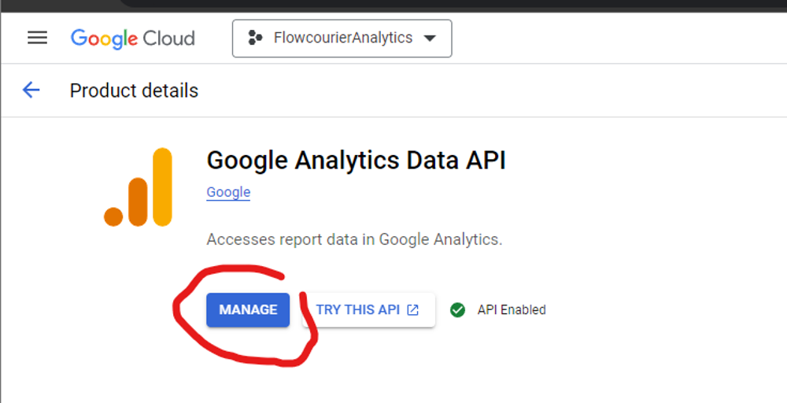
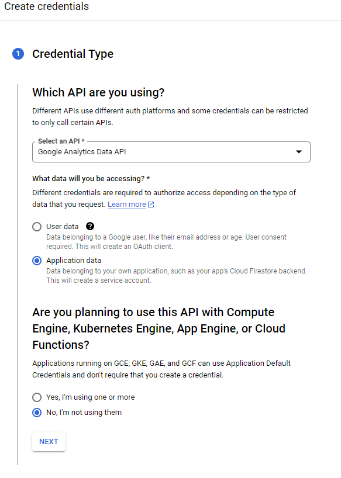
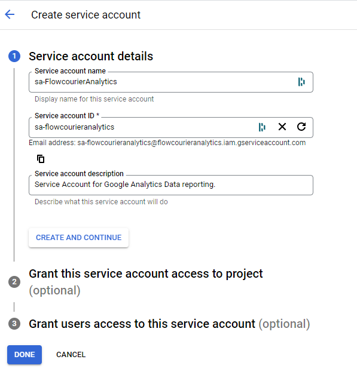
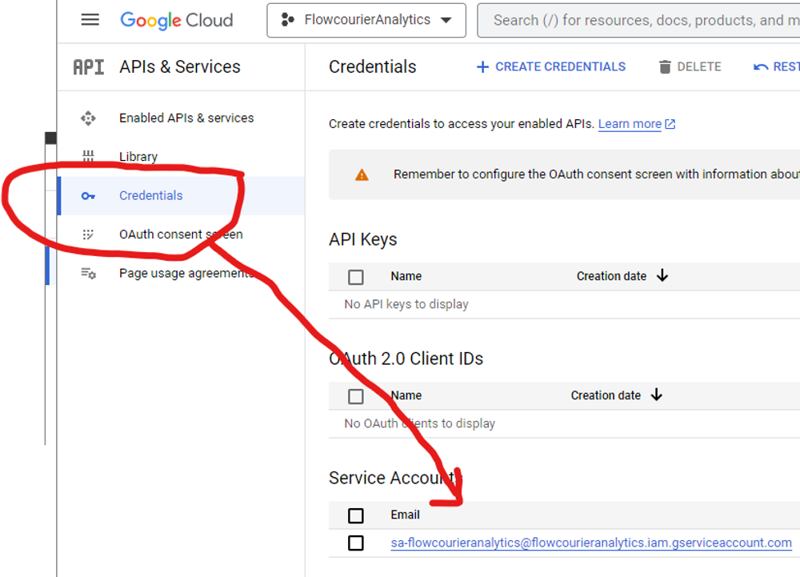

import { Steps } from '@astrojs/starlight/components';

# Configure Access to Google Services

On this page, you'll learn how to set up a dedicated Service Account to access Google Analytics, Google Search Analytics and PageSpeed Insights data. This Service Account is used by Flowcourier to securely retrieve and analyze Google Analytics data.

### 1. Create a new project
Go to [Google APIs](https://code.google.com/apis/console/) and create a new project, for example, "FlowcourierAnalytics" _(or use an existing project)_.

### 2.  API's & services
Click "ENABLE APIS AND SERVICES" in Enabled API's & services.


### 3. Google Analytics Data API
1. Search "Google Analytics Data API," select it, and click the ENABLE button.
 Repeat the same for Google PageSpeed Insights API and Google Search Console API



 Remember to enable all three APIs:

 ```
Google Analytics Data API
Google Search Console API
Google PageSpeed Insights API
 ```

### 4. Create credentials
In the Manage view of "Google Analytics Data API," click the CREATE CREDENTIALS button.

- Choose Application data
- In "Are you planning to use this API with Compute Engine..." answer No.
- Click the NEXT button.



### 5. Service Account Details
Give a name, for example, "sa-FlowcourierAnalytics," and press the CREATE button.



### 6.  Credentials
In Google Cloud Console, click credentials on the left menu and copy the Service Account Email address.



Now you have a Google Cloud project that can access "Google Analytics Data API" with a new service account.

Please copy the Service Account Email address, as you will need it in the next step.

---

