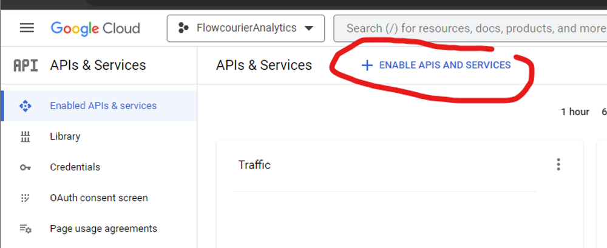
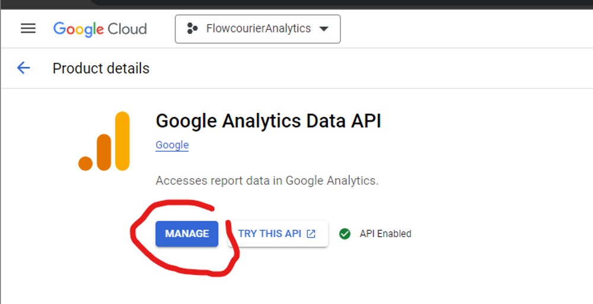
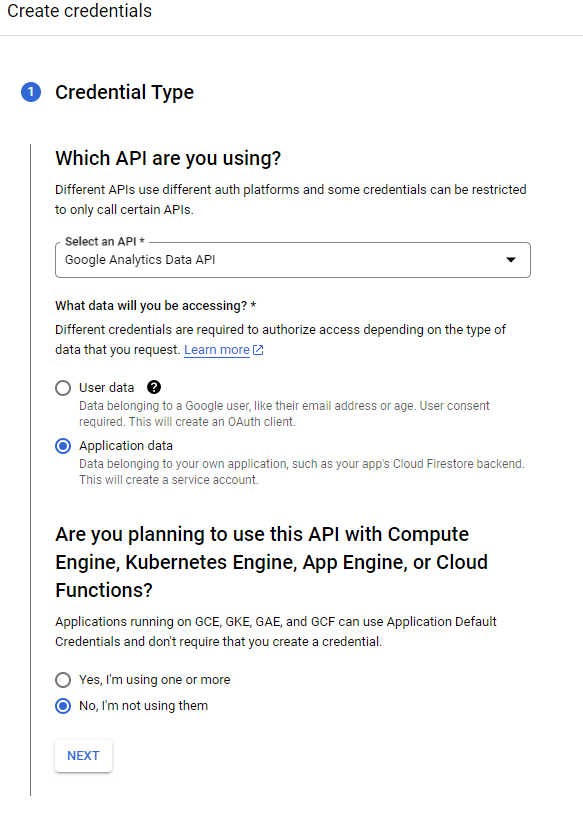
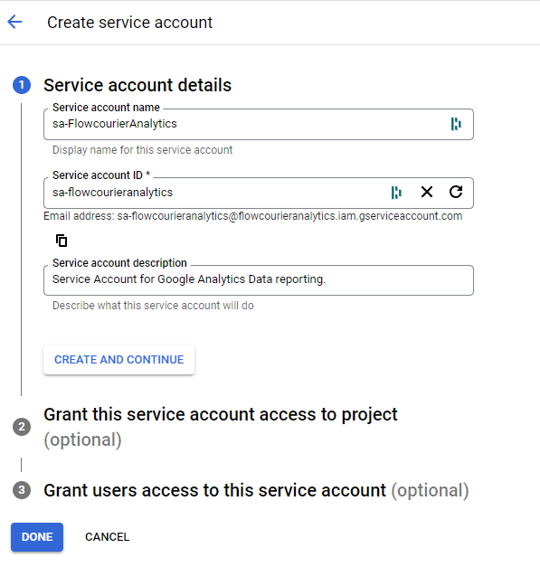
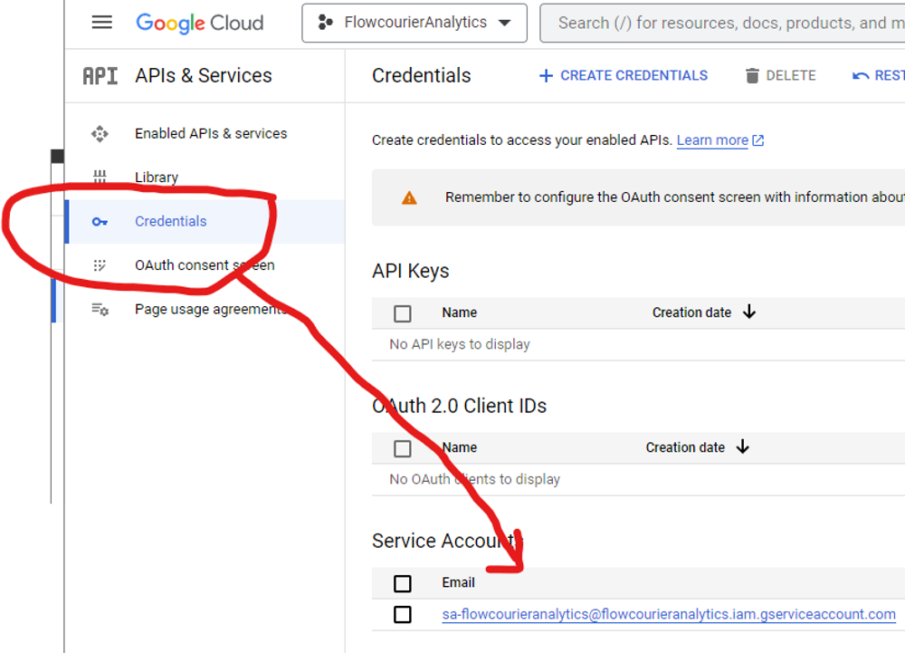

import { Steps } from '@astrojs/starlight/components';

# Configure Access to Google Services

On this page, you'll learn how to set up a dedicated service account with access to Google Analytics, Google Search Console and PageSpeed Insights data. Flowcourier uses this service account to securely retrieve and analyze your Google Analytics data.

### 1. Create a new project
Go to the [Google Cloud Console](https://console.cloud.google.com/apis/dashboard) and create a new project, for example, "FlowcourierAnalytics" _(or use an existing project)_.

### 2. APIs & Services
In **Enabled APIs & services**, click **ENABLE APIS AND SERVICES**.



### 3. Enable the three APIs
Search for "Google Analytics Data API", select it, and click the **ENABLE** button. Repeat the same for the Google Search Console API and the Google PageSpeed Insights API.



Remember to enable all three APIs:

 ```
Google Analytics Data API
Google Search Console API
Google PageSpeed Insights API
 ```

### 4. Create credentials
In the Manage view of "Google Analytics Data API", click the **CREATE CREDENTIALS** button.

- Choose **Application data**.
- To the question "Are you planning to use this API with Compute Engine…", answer **No**.
- Click the **NEXT** button.



### 5. Service account details
Give the service account a name, for example, "sa-FlowcourierAnalytics", and press the **CREATE** button.



### 6. Copy the service account email
In the Google Cloud Console, click **Credentials** in the left menu and copy the service account email address — you will need it in the next step.



You now have a Google Cloud project with a service account that can access the Google Analytics Data API. In the next step, you'll give that service account access to your Google Analytics property.

---
