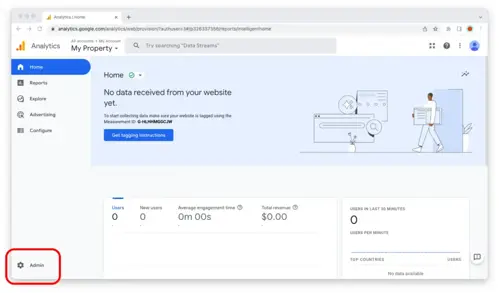
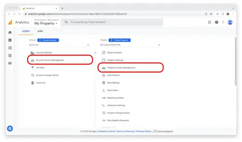
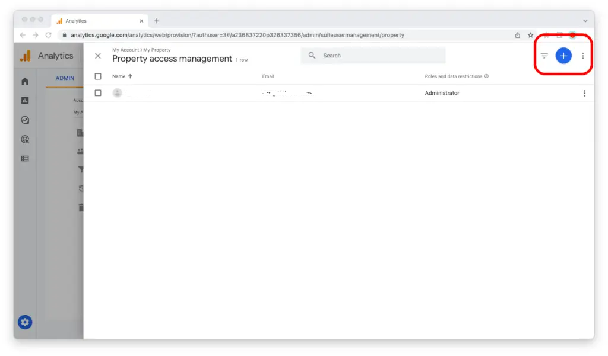
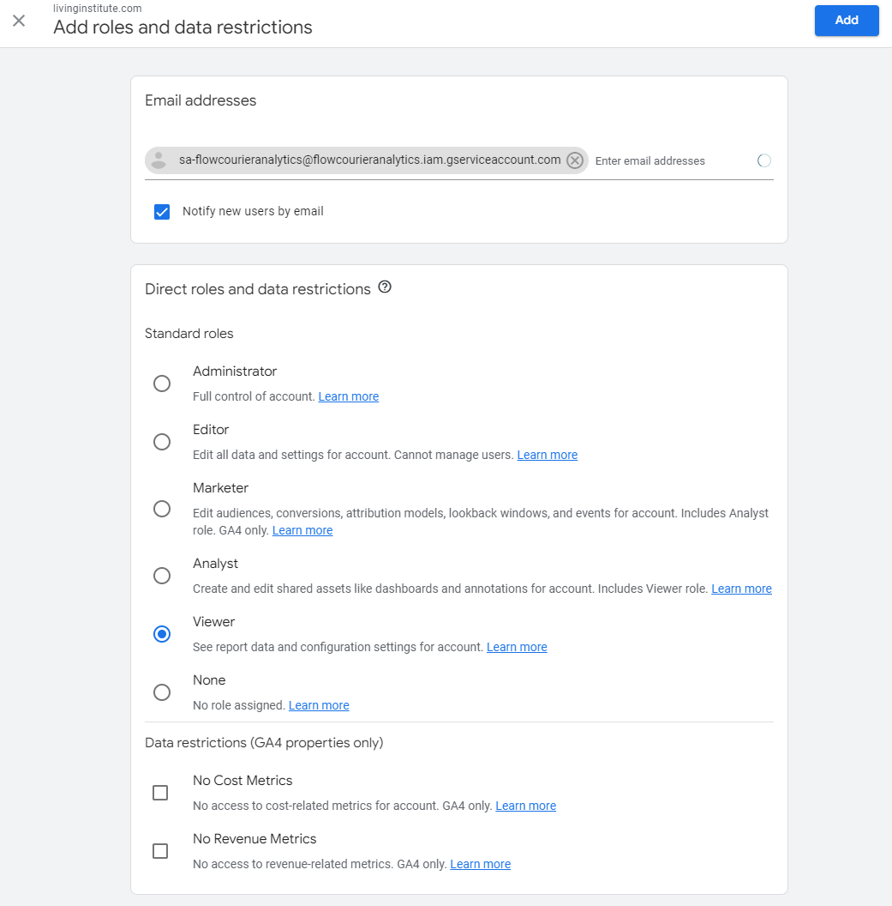

import { Steps } from '@astrojs/starlight/components';

## Give the Service Account Access to Your Google Analytics Property

In the previous step, we created a service account. Now we give that service account read access to your Google Analytics property — exactly the same way you would invite any user. If you are not familiar with Google Analytics access management, follow the steps below.

### 1: Log in to Google Analytics
Sign in at [analytics.google.com](https://analytics.google.com/) with a Google account that has the Administrator role for the account or property you want to grant access to.

### 2: Open the Google Analytics settings
Go to the property in question and click the gear icon in the lower-left corner of the screen.

### 3: Open access management
To grant access at the account level, click **Account Access Management**. To grant access to a single property only, click **Property Access Management**.

### 4: Add a user
Click the blue **+** icon in the upper-right corner of the screen, then select **Add users**.

### 5: Paste the service account email
Paste in the service account email address (copied in the previous step) and select the **Viewer** role.

### 6: Confirm
Click the blue **Add** button in the upper-right corner of the screen.

The service account now has access to your Google Analytics property!

In the next step, we will configure the extension in Umbraco to use this service account to read the data from Google's APIs.

---
