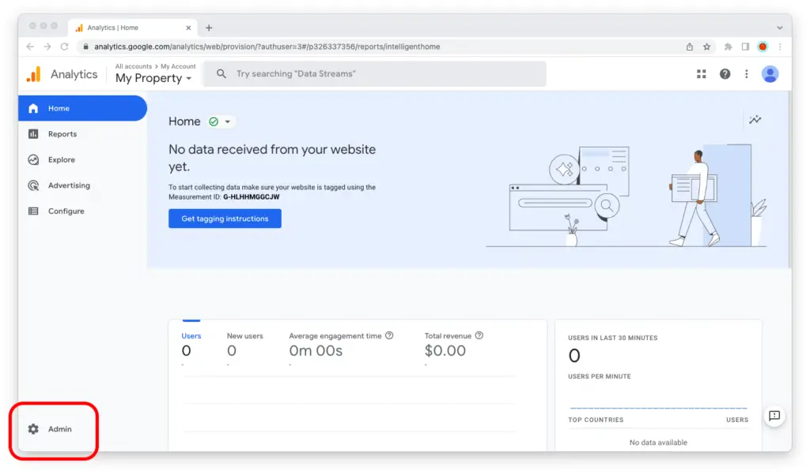
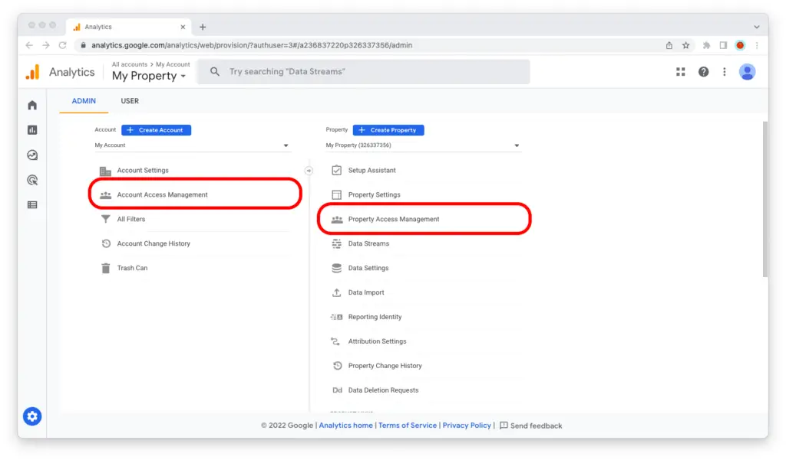

import { Steps } from '@astrojs/starlight/components';

## Give Service Account Access to Google Analytics Property

In the previous step, we created a Service Account. Now we want to give this service account read access to the Google Analytics property. This is as easy as giving access to any user. If you are not familiar with Google Analytics Access Management, you can follow these simple steps below.

### 1: Login to Google Analytics
Sign in to the Google account at [analytics.google.com](https://analytics.google.com/) with an Administrator role for the account or property that you want to grant access to.

### 2: Open Google Analytics Settings
Go to the property in question and click on the gear icon in the lower-left corner of the screen.

### 3: Grant Access
To grant access to the GA account, click on "Account Access Management." To grant access to the GA property, click on "Property Access Management."

### 4: Add user
Click on the blue "+" icon in the upper-right corner of the screen, then select "Add users."

### 5: Paste Service Account Email 
Paste in the service account email address and select their Viewer role.

### 6: Add Roles and Data Restrictions 
Click on the blue "Add" button in the upper-right corner of the screen.

Now the service account has access to the Google Analytics property!

On the next step we will configure the extension in Umbraco to use this service account to access the data in Google API's.

---
