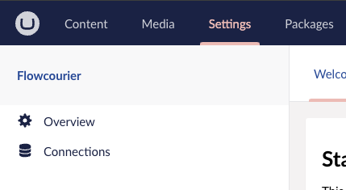
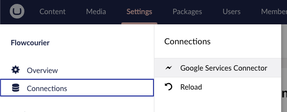
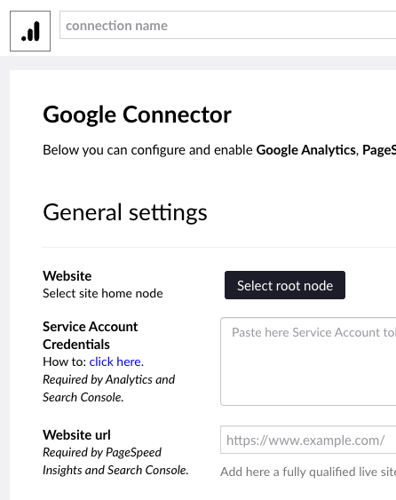
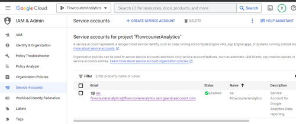
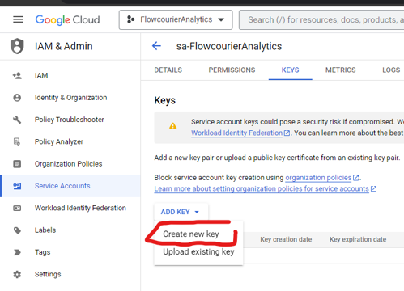
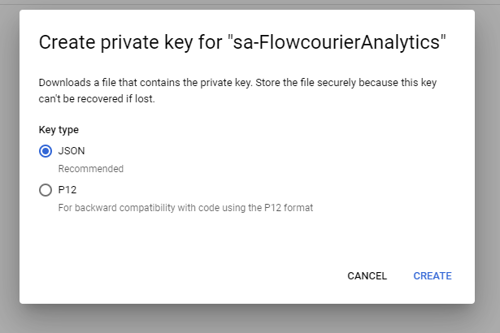
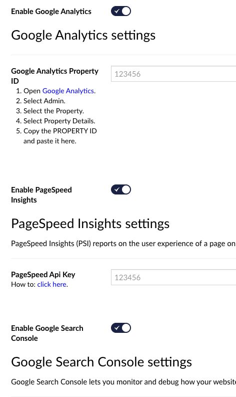
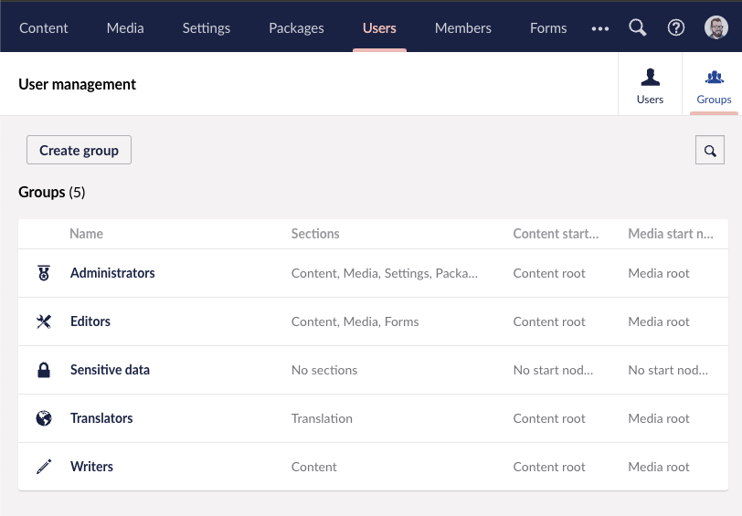
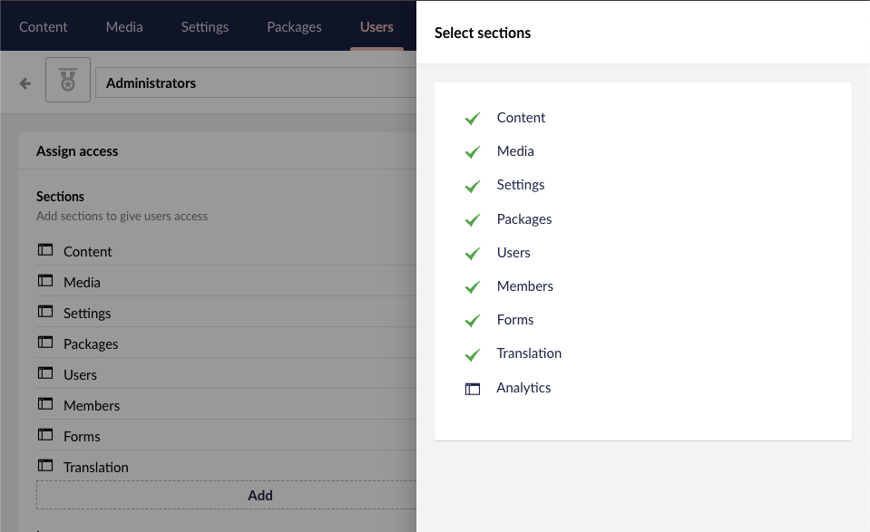

On this last step, we will configure the extension in Umbraco to use the Service Account to access Google Analytics and Search reports and PageSpeed Insights reports.

The Google Analytics by Flowcourier UI is split over three sections within the Umbraco back-office:

* **Settings/Flowcourier** Settings area (only for Umbraco Administrators)
* **Analytics** For getting site wide statistics, basically Google Analytics Overview and Google Search Console Overview optimized for CMS users
* **Content / Visitors** For viewing page specific statistics, performance and SEO data

## Create data Connection in Umbraco Settings

### 1. Go to Umbraco Settings area
To create a new connection to Google Analytics, you need to go to the Flowcourier settings in Umbraco back-office as Umbraco Administrator.

### 2. Add Google Services Connector
On the Connections -item, add new connection by clicking the "Google Services Connector" link.

### 3. Fill required fields
Fill the required fields in the form. You can find the required information from the Google Cloud Console.

* **Connection Name**: Give a name for the connection for example "Google Analytics"
* **Website**: Select here the Home node of Umbraco. This is needed for routing the path to the correct page. 
* **Service Account Credentials**: Paste here JSON key of the Service Account.
* **Website URL**: This is canonical URL that your website is seen by Google. The URL is needed by Google Search and PageSpeed to find the page with full URL.

#### 3.1 Service Account Credentials
Now it is time to tell Google Analytics by Flowcourier to use the Service Account to read data from Google Analytics.

####  3.2 Go to Google Cloud Console IAM & Admin 
Go to the [Google Cloud Console](https://console.cloud.google.com/iam-admin/serviceaccounts?project=flowcourieranalytics) and in IAM & Admin, open Service Accounts. Then click your Service Account.

####  3.3  Create Key
Click the KEYS tab and then click the ADD KEY > Create new key button.

#### 3.4  Download JSON Key
Choose the JSON key type.

### 4. Enable Google Services
Enable here Google Analytics, Google Search Console and Google PageSpeed Insights services by following the instructions on the screen.

## Give users access to Analytics -section

All users should already have access to the Content and Visitors sections, but the Analytics section is only available to Users who have been granted access to it. To give access to the Analytics section, you will need to go Groups in User Management section in the Umbraco back-office.

### Create a new User Group or add to existing group to access Analytics section
Create a new User Group or add to existing

Now try to reload the Umbraco back-office and you should see the Analytics section in the top menu.

## Install License

Once you have purchased a license you can install it by dropping the license file directly into your sites umbraco\Licenses folder. Flowcourier will automatically scan this directory for any valid licenses.

---

**CONGRATULATIONS!** You have now successfully configured the Google Analytics by Flowcourier extension in Umbraco.

