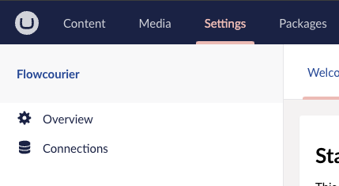
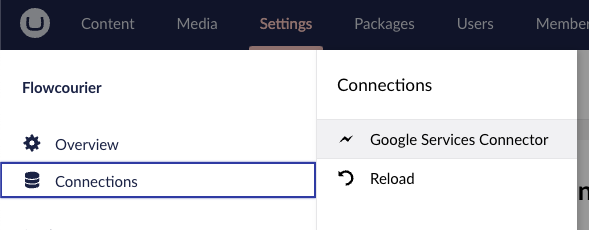
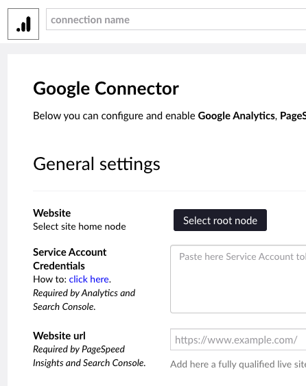
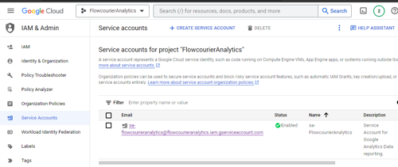
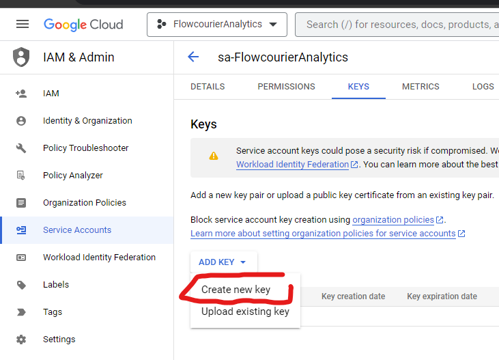
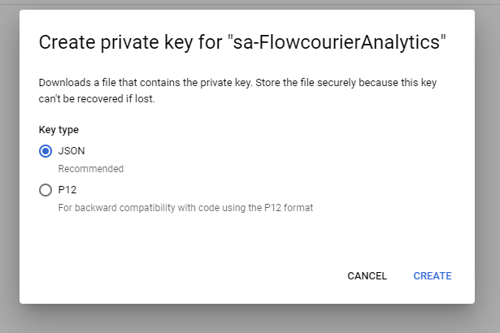
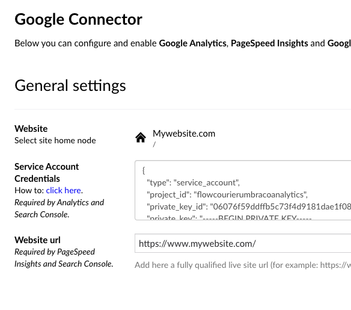
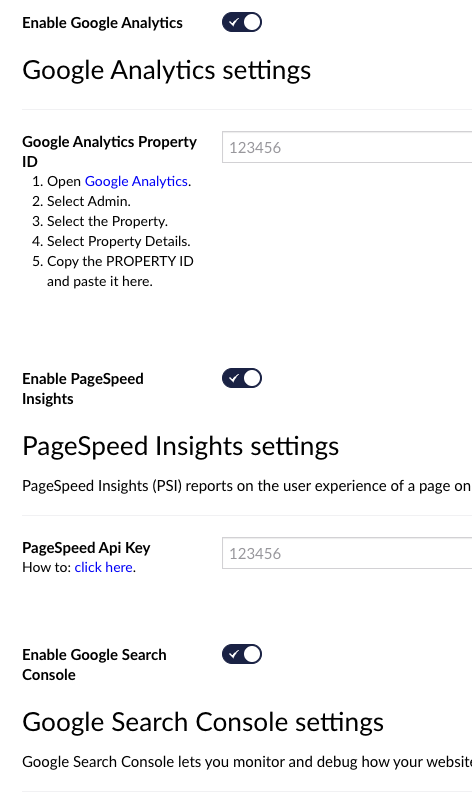
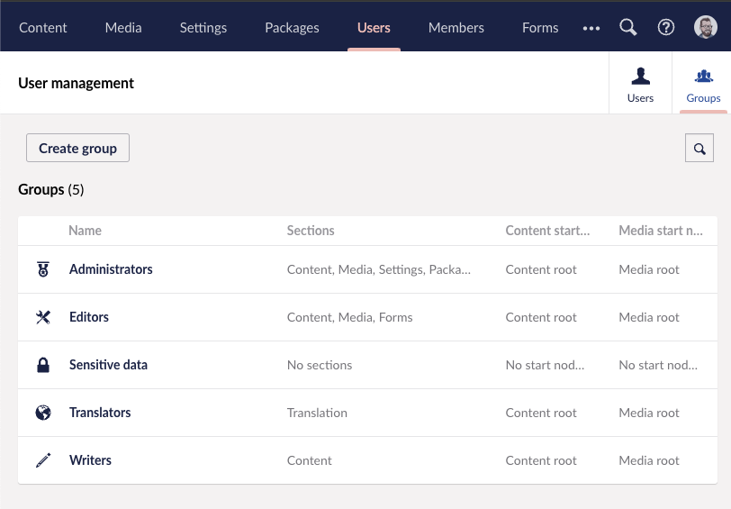
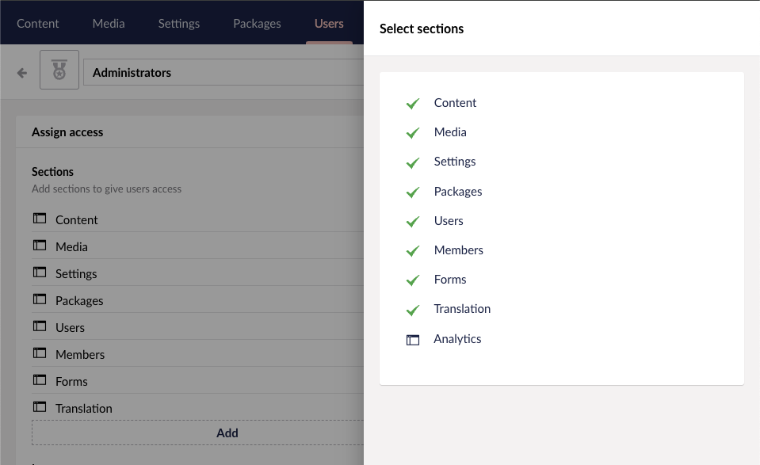

In this last step, we configure the extension in Umbraco to use the service account for Google Analytics, Google Search Console and PageSpeed Insights reports.

The Google Analytics by Flowcourier UI is split over three areas of the Umbraco backoffice:

* **Settings → Flowcourier** — connection settings (Umbraco administrators only)
* **Analytics** — site-wide statistics: a Google Analytics overview and a Google Search Console overview, optimized for CMS users
* **Content → Visitors** — per-page statistics, performance and SEO data


## Create a Data Connection in Umbraco Settings

### 1. Go to the Umbraco Settings area
To create a new connection to Google Analytics, go to **Settings → Flowcourier** in the Umbraco backoffice as an Umbraco administrator.




### 2. Add the Google Services Connector
On the **Connections** item, add a new connection by clicking the **Google Services Connector** link.



### 3. Fill in the required fields


* **Connection Name**: A name for the connection, for example "Google Analytics".
* **Website**: Select the home node of your Umbraco site. Page paths are resolved relative to this node when mapping analytics data to your content.
* **Service Account Credentials**: The JSON key of the service account. Steps 3.1–3.4 below show how to create and download it.
* **Website URL**: The canonical URL under which Google sees your website. Google Search Console and PageSpeed Insights use it to build the full URL of each page.


#### 3.1 Go to Google Cloud Console IAM & Admin
Go to the [Google Cloud Console](https://console.cloud.google.com/iam-admin/serviceaccounts) and in **IAM & Admin**, open **Service Accounts**. Then click your service account.



#### 3.2 Create a key
Click the **KEYS** tab and then click **ADD KEY → Create new key**.



#### 3.3 Download the JSON key
Choose the **JSON** key type.



#### 3.4 Paste the JSON key into the Umbraco backoffice
Open the downloaded JSON key file in a text editor and copy its entire content into the **Service Account Credentials** field in the Umbraco backoffice. It should look like this:

```json
{
  "type": "service_account",
  "project_id": "flowcourieranalytics",
  "private_key_id": "xxxxxxxxxxxxxxxxxxxxxxxxxxxxxxxxxxxxxxxx",
  "private_key": "xxxxxxxxxxxxxxxxxxxxxxxxxxxxxxxxxxxxxxxx"
}
```

The finished configuration should look like the screenshot below:





### 4. Enable the Google services
Enable the Google Analytics, Google Search Console and Google PageSpeed Insights services by following the instructions on the screen.



## Give Users Access to the Analytics Section

All users already have access to the Content section (and its Visitors views), but the **Analytics** section is only visible to users who have been granted access to it. To grant access, go to **Groups** under the Users area of the Umbraco backoffice.



### Add the Analytics section to a user group
Create a new user group, or edit an existing one, and add the **Analytics** section to it.


Reload the Umbraco backoffice, and the Analytics section appears in the top menu for the members of that group.


## Install the License

Once you have purchased a license, install it by dropping the license file into your site's `umbraco/Licenses` folder. Flowcourier automatically scans this directory for valid licenses.

---

**CONGRATULATIONS!** You have now successfully configured the Google Analytics by Flowcourier extension in Umbraco.
